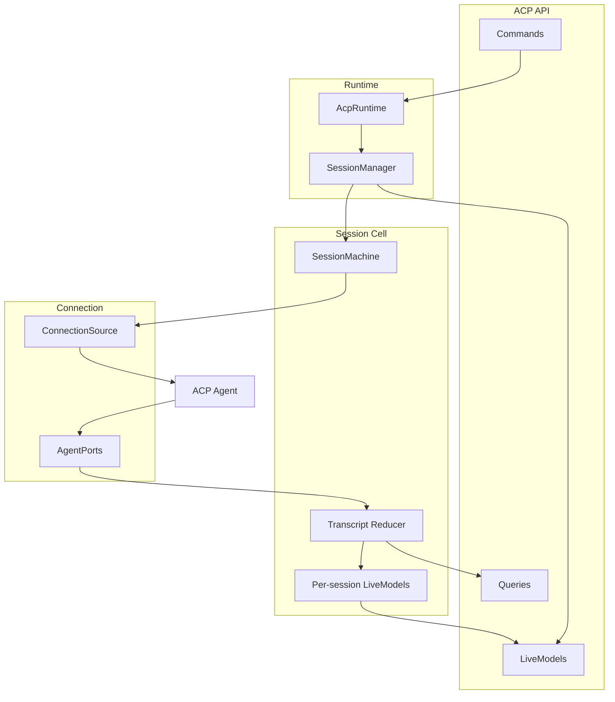

# ACP Runtime Architecture

The ACP runtime is the domain service that serves the ACP API contract. It owns
the host-scoped dependencies needed to run provider ACP sessions, but it should
not mix cross-session routing with per-session state projection.

## Ownership

- `AcpRuntime` is the composition root. It wires the ACP API contract to shared
  ports, the managed connection source, and the session manager.
- `SessionManager` owns cross-session lifecycle: session creation, routing ACP
  `sessionId`s to conversation cells, process cleanup, and the sessions-list live
  model.
- `SessionCell` owns one conversation: the state machine, transcript reducer,
  per-session live models, permission broker, prompt queue effects, and turn
  quiescence.
- The ACP connection source owns provider processes through `createManagedSource`.
  Processes are keyed by provider and workspace and can host multiple ACP sessions.
- Models under `packages/core/src/acp/models/` are the shared vocabulary for
  reducer output, live model state, and the public ACP API contract.
- Runtime implementation code lives under `packages/runtime/src/acp-agents/`; core keeps
  the contract, models, reducer vocabulary, errors, and transport ports.
- Node host adapters live behind explicit Node-only subpaths:
  `@emdash/runtime/acp-agents/node` for the ACP child-process bootstrap and attachment
  store, and `@emdash/core/pty/node` for the lazy `node-pty` spawner.

## Command and Read Paths

Commands enter through the API and are routed by `AcpRuntime` to the
`SessionManager`. Lifecycle commands such as starting and stopping sessions are
handled by the manager because there is no cell before a session exists. Session
commands are routed to an existing `SessionCell`, where the pure
`SessionMachine` decides whether the command is valid and emits effects for the
cell to interpret.

Provider updates move in the opposite direction. The connection handler receives
ACP callbacks, normalizes raw `SessionUpdate`s through the provider's enrich
hook, and asks the `SessionManager` to route the event to a cell. The cell folds
the event through the reducer and publishes changed slices through live models.

Provider `sessionId` persistence is owned by the host that consumes the ACP API.
The runtime returns the session id from `startSession` and `resumeSession`; desktop
persists that returned value at the client boundary instead of using a child-to-host
callback.

`editCurrentPrompt` and `exportACPTranscript` are intentionally contract-only
placeholders for now. Workspace-server stubs should keep typechecking against
the contract, but core does not serve implementations until those workflows are
designed.

## Process Hosting

Desktop-local ACP and workspace-server ACP both use plain Node child processes via
`spawnWorker()`. The child process entry calls
`bootAcpRuntimeProcess()` from `@emdash/runtime/acp-agents/node`, which constructs
`AcpRuntime`, a machine-scoped `AgentPluginHost`, `ChildAcpProcessHost`,
`LocalAttachmentStore`, and `NodePtySpawner`. The `AgentPluginHost` owns the
runtime process's plugin registry, execution context, plugin filesystem, env, home
directory, host dependency manager, and spawn-context cache; ACP-specific
resources such as process handles, ACP ports, terminal management, attachment
storage, and session cells stay inside the ACP runtime. Each host owns a worker
manifest that maps the ACP worker id to the emitted child-process entry path for
that host's build.

The concrete plugin registry is injected by each host entry (`emdash-desktop` and
`workspace-server`) rather than imported by `@emdash/runtime`; this keeps runtime
from depending back on `@emdash/plugins` while still letting plugin resolution be
owned by the runtime composition root.

Desktop relies on Electron's `child_process.fork` behavior, which runs children
with `ELECTRON_RUN_AS_NODE`. The packaged app must keep the `RunAsNode` fuse
enabled while this fork model is used. If the app later disables that fuse for
macOS hardening, the wire package still has the `utilityProcessHost` seam for an
Electron utility-process implementation.

## Models and Protocol Versioning

The ACP API contract should reference the schemas in `packages/core/src/acp/models/`
instead of maintaining duplicate workspace-server schemas. This means wire-facing
model changes are protocol changes. Follow the workspace-server compatibility
rules:

- Add optional fields for backward-compatible minor changes.
- Treat required field changes, removals, renames, and incompatible union changes
  as major protocol changes.
- Keep wire envelopes such as history pages, terminal output stream events, and
  runtime errors in the ACP API layer because they are transport framing, not
  domain models.
