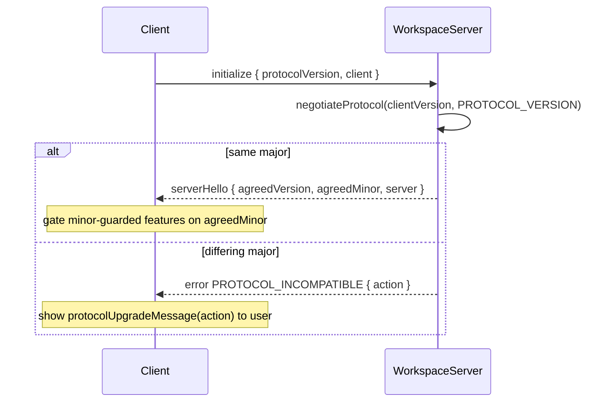

# Workspace Server

The Workspace Server (`apps/workspace-server/`) is a Node daemon that runs on a remote machine and exposes workspace runtimes (git, files, deps, ACP, …) to Emdash clients over the `@emdash/wire` protocol. Clients connect over an SSH-forwarded Unix socket; the daemon is independently lived and can be running when clients upgrade, downgrade, or are absent entirely.

The contract lives in `packages/core/src/workspace-server/`, shared by the server and every client so TypeScript clients stay in sync at build time. Non-TypeScript clients (e.g. a future mobile app) use the negotiation handshake at runtime — compile-time sharing is a convenience, not the contract.

The ACP domain is mounted under `workspaceWireContract.acp` and is served by a
forked child process. The daemon parent forwards the ACP API contract to the child
and receives ACP session ids through `startSession` / `resumeSession` return
values. Runtime spawn context is resolved inside the child runtime and structured
child logs are forwarded from stderr. This mount was added before any
workspace-server contract deployment, so the initial addition intentionally does
not bump `PROTOCOL_VERSION`; future deployed additions must follow the rules below.

## Protocol Version

The wire contract is versioned with a single [semver](https://semver.org) string, defined in [`packages/core/src/workspace-server/versions.ts`](../../packages/core/src/workspace-server/versions.ts):

```ts
export const PROTOCOL_VERSION = '1.0.0';
```

### What each component means

| Component | Meaning | Compatibility |
|-----------|---------|---------------|
| **major** | Breaking wire change — removed or retyped field, changed procedure name, changed framing | Incompatible across differing majors |
| **minor** | Additive, backward-compatible — new procedure, new optional field, new ignorable event kind | Compatible; negotiated feature level is `min(clientMinor, serverMinor)` |
| **patch** | No wire impact — bugfix, performance, internal refactor | Always compatible; informational only, ignored by negotiation |

**Compatibility rule**: same major implies compatible. On a major mismatch, the lower major is the stale side and determines the upgrade prompt.

## Behavior-Change and Versioning Rules

### When to bump minor (additive, non-breaking)

- Adding a new procedure.
- Adding an optional field to an existing request or response schema (must be `.optional()` or carry a default; never add a required field in a minor bump).
- Adding a new event kind to an event iterator output where old clients can safely ignore the unknown kind.
- Introducing opt-in behavior that is gated on `agreedMinor >= N` — the client checks `agreedMinor` and falls back gracefully when the server doesn't offer it.

### When to bump major (breaking)

- Removing or renaming a field, procedure, or error code.
- Changing the type or semantics of an existing field.
- Changing how requests are framed or how errors are encoded on the wire.
- Adding an event kind that old clients **must** handle (rather than ignore).

### When to bump patch (no wire change)

- Fixing a bug that does not alter observable wire behavior.
- Internal performance or correctness improvements.

### Never do these

- Silently change the semantics of an existing call at the same version.
- Add a required field to an existing schema in a minor bump.
- Repurpose an existing field for a different meaning — add a new field and deprecate the old one.
- Remove a field or procedure without a major bump and a deprecation window.

### Discriminated unions

The contract uses many discriminated unions (e.g. `GitPathInspection`, `GitStatusModel`, error unions). Adding a new variant is a **minor bump only if** old clients can safely ignore unknown variants with a default/fallback branch. If the client must handle the new variant to function correctly, it is a **major bump**.

### Schema parsing and unknown fields

Zod strips unknown keys on `.parse()` by default. This is the correct behavior for a tolerant reader: an old client receiving a new response silently ignores new fields. Do not rely on parse to preserve unknown fields if the value is forwarded elsewhere.

## Initialize Handshake

Every client must call `initialize` as the first procedure on a new connection before using any other procedure. Because the daemon is independently lived, `initialize` must be re-called on every reconnect — the daemon may have changed versions between connections.

### Request (client → server)

```ts
{
  protocolVersion: string;  // the client's PROTOCOL_VERSION
  client: {
    id: string;             // 'emdash-desktop' | 'emdash-mobile' | ...
    appVersion: string;     // the application's own version (for telemetry)
  };
}
```

### Response (server → client)

```ts
{
  protocolVersion: string;  // the server's own PROTOCOL_VERSION
  agreedVersion: string;    // major.min(clientMinor, serverMinor).0
  agreedMinor: number;      // clients gate minor-guarded features on this
  server: {
    appVersion: string;
    daemonId: string;       // stable per-process identity, set at startup
    startedAt: number;      // Unix ms when the daemon started
  };
}
```

### Failure: PROTOCOL_INCOMPATIBLE

When majors differ the server throws a typed `PROTOCOL_INCOMPATIBLE` error:

```ts
{
  action: 'upgrade-client' | 'upgrade-server';
  clientProtocolVersion: string;
  serverProtocolVersion: string;
}
```

`action` is `'upgrade-client'` when the client major is lower (stale desktop app) and `'upgrade-server'` when the client major is higher (stale daemon). Use `protocolUpgradeMessage(action)` from `@emdash/core/workspace-server` to produce a consistent user-facing string.

### Negotiation flow



### Gating a minor-guarded feature (example)

```ts
// Server introduces a new subscribe feature at protocol 1.1.0.
// Clients with agreedMinor >= 1 may call it; others fall back to polling.
const session = await connect(client, appVersion);
if (session.agreedMinor >= 1) {
  // use git.worktree.subscribe
} else {
  // fall back to polling
}
```

## Key Files

| Path | Role |
|------|------|
| [`packages/core/src/workspace-server/versions/index.ts`](../../packages/core/src/workspace-server/versions/index.ts) | `PROTOCOL_VERSION`, `negotiateProtocol`, `protocolUpgradeMessage` |
| [`packages/core/src/workspace-server/wire/schemas.ts`](../../packages/core/src/workspace-server/wire/schemas.ts) | initialize/health schemas |
| [`packages/core/src/workspace-server/wire/contract.ts`](../../packages/core/src/workspace-server/wire/contract.ts) | wire contract (`health`, `initialize`, `git`, `files`, `deps`, `tuiAgents`, `acp`) |
| [`apps/workspace-server/src/api/controller.ts`](../../apps/workspace-server/src/api/controller.ts) | Server-side procedure and live-model handlers |
| [`apps/workspace-server/src/acp/host.ts`](../../apps/workspace-server/src/acp/host.ts) | Parent-side ACP child process host and spawn-context resolution |
| [`apps/workspace-server/src/index.ts`](../../apps/workspace-server/src/index.ts) | CLI and daemon entry point |
