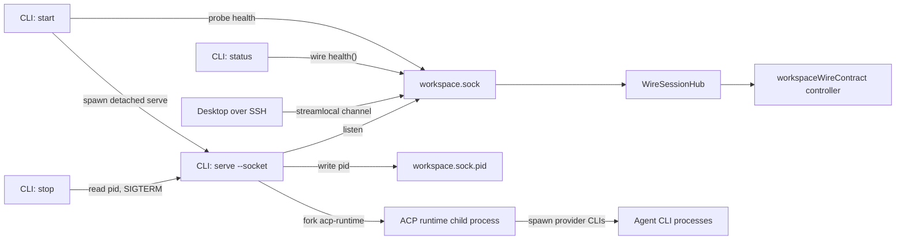

# Workspace Server Daemon

The workspace server is a per-user Node process that exposes the
`workspaceWireContract` over either a Unix domain socket or stdio. The production
remote path is socket mode: the desktop connects over SSH stream-local forwarding
to the daemon's Unix socket, and the daemon serves each accepted socket as an
independent wire session.

Stdio mode runs the same controller over stdin/stdout. It is primarily a test and
debugging harness because stdout is reserved for the wire protocol.

## Process Roles

The command line has two roles:

- `serve` is the foreground server process. In socket mode, this is the daemon.
- `start`, `stop`, and `status` are short-lived lifecycle commands that manage or
  inspect the daemon process.



## Commands

Foreground serving:

```bash
emdash-workspace-server serve --socket
emdash-workspace-server serve --socket ~/.emdash/workspace-server/run/workspace.sock
emdash-workspace-server serve --stdio
```

Daemon lifecycle:

```bash
emdash-workspace-server start
emdash-workspace-server status
emdash-workspace-server stop
```

For backwards compatibility, invoking the binary with only flags still means
`serve`:

```bash
emdash-workspace-server --socket
emdash-workspace-server --stdio
```

Lifecycle commands use socket mode. Passing `--socket <path>` selects a custom
daemon instance; otherwise they use the default socket path.

## Runtime Files

All runtime files are derived from the socket path so custom socket paths remain
self-contained:

```text
~/.emdash/workspace-server/run/workspace.sock
~/.emdash/workspace-server/run/workspace.sock.pid
~/.emdash/workspace-server/run/workspace.sock.lock
~/.emdash/workspace-server/run/workspace.sock.log
~/.emdash/workspace-server/run/acp-attachments/
```

- `.sock` is the Unix domain socket accepted by the foreground daemon.
- `.pid` records the daemon process id after socket serving starts.
- `.lock` prevents competing `start` calls from spawning duplicate daemons.
- `.log` receives stdout/stderr from the detached daemon process.
- `acp-attachments/` stores uploaded ACP prompt attachments for the runtime child.

The socket directory is created with mode `0700`, so the filesystem boundary is
the local user account. Desktop clients reach the socket through SSH, not through
a TCP listener.

## Start Flow

`start` is intentionally conservative:

1. Derive socket, pid, lock, and log paths.
2. Acquire the exclusive lock file.
3. Probe the socket with the wire `health` procedure.
4. If the daemon is already healthy, return successfully without spawning.
5. Remove stale pid/socket files when no healthy daemon is present.
6. Spawn `serve --socket <path>` as a detached child with stdout/stderr redirected
   to the log file.
7. Wait until the socket answers `health`, then exit.

The lifecycle command does not keep the daemon alive after spawning it. Once the
detached `serve` process is healthy, it owns the socket and pid file until it
exits.

## Serve Flow

`serve --socket` owns the long-lived server lifecycle:

1. Create the socket directory.
2. Probe any existing socket file before unlinking it. A live socket blocks
   startup; a dead socket file is removed.
3. Listen on the Unix socket.
4. Write the pid file.
5. For every accepted `net.Socket`, convert it to a `WireTransport` and open a
   session in `createWireSessionHub`.
6. In socket mode, fork the ACP runtime child and mount its API under
   `workspaceWireContract.acp`.
7. On `SIGINT` or `SIGTERM`, dispose all wire sessions, close the server, unlink
   the socket, remove the pid file, stop the ACP runtime child, and exit.

The session hub is what lets one daemon serve multiple client connections while
keeping per-client live subscriptions, in-flight calls, and blob channels scoped
to the connection that created them.

## ACP Runtime Child

Socket mode mounts the ACP runtime as a child process. The parent daemon uses
`spawnWorker()` from `@emdash/wire/worker` to fork the ACP worker path declared in
the workspace-server worker manifest. The child calls the shared
`bootAcpRuntimeProcess()` helper from `@emdash/runtime/acp-agents/node`.

One wire contract uses the process IPC channel:

- Parent to child: `acpApiContract`, exposed to desktop clients as
  `workspaceWireContract.acp`.

The runtime resolves provider binaries from host dependency descriptors derived
from the plugin registry. The environment passed to provider CLIs is intentionally
allowlisted via the shared spawn-context resolver; the full daemon environment is
not forwarded. Runtime logs are emitted as structured stderr lines and forwarded by
the parent process.

`startSession` and `resumeSession` return `{ sessionId }` through the ACP API. The
connected desktop client owns persistence for those returned ids when remote ACP
consumption is added.

## Stop Flow

`stop` uses the pid file rather than a wire shutdown RPC:

1. Read `<socketPath>.pid`.
2. If the pid file is missing or the process is already gone, remove the stale pid
   file and report `not-running`.
3. Send `SIGTERM` to the recorded pid.
4. Poll until the process is gone and the socket no longer answers `health`.
5. Remove the pid file.

There is no automatic `SIGKILL` escalation. A stuck process should be surfaced to
the caller rather than hidden.

## Status Flow

`status` connects to the Unix socket and calls `health`. A healthy response prints
the socket path, version, and uptime. A failed probe exits non-zero and reports
whether the daemon is not running or unhealthy.

## Code Map

- `src/index.ts` parses config, dispatches commands, and installs signal handlers
  for `serve`.
- `src/config.ts` defines command and serve-mode parsing.
- `src/daemon/paths.ts` centralizes socket, pid, lock, and log paths.
- `src/daemon/probe.ts` implements the wire `health` probe.
- `src/daemon/start.ts` implements locked detached startup and health waiting.
- `src/daemon/stop.ts` implements pid-file based `SIGTERM` shutdown.
- `src/daemon/status.ts` implements the status probe.
- `src/wire/serve-socket.ts` owns Unix socket serving and maps each accepted
  socket into a wire session.
- `src/wire/serve-stdio.ts` serves the same controller over stdin/stdout.
- `src/api/controller.ts` builds the `workspaceWireContract` controller.

## Desktop Integration

Desktop-side daemon bootstrap is intentionally separate from this server package.
The intended flow is:

1. Resolve or establish the SSH connection.
2. Run `emdash-workspace-server start` on the remote host.
3. Open an SSH stream-local channel to the socket path.
4. Wrap that channel in `streamTransport(channel, channel)`.
5. Create a wire client and call `initialize`.

See `client-connection.md` for the target desktop-to-daemon connection model.
