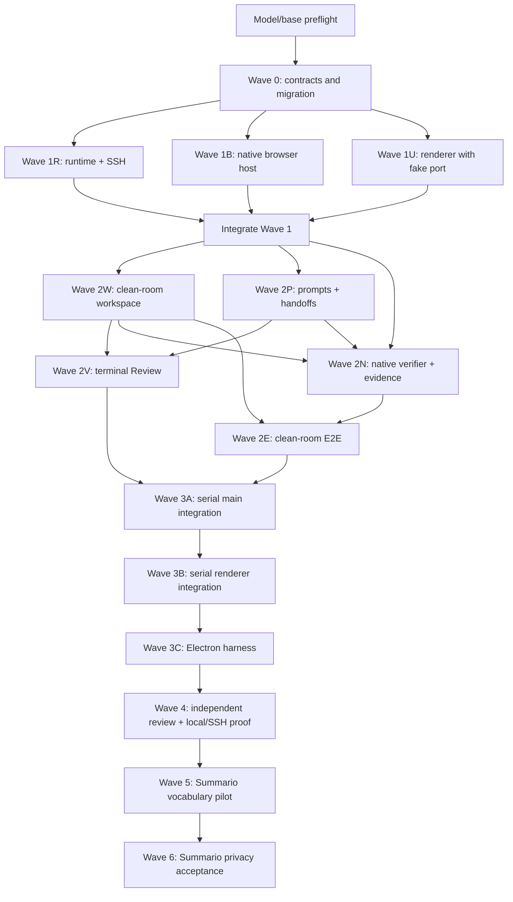

# ACP Loops v2: concise Codex orchestrator handoff

Give this file to the lead Codex agent. It is the short execution entrypoint; the linked ExecPlan is
the authoritative implementation contract and living progress record.

## Copy-paste prompt

> Orchestrate ACP Loops v2 from `docs/plans/acp-loops-v2-codex-handoff.md`. Before editing, read
> the complete `docs/plans/acp-loops-v2-codex-orchestration.md`, root `AGENTS.md`, and the routed
> agent docs it names. Use the Codex ACP provider and the caller-verified GPT-5.6 Sol catalog model
> for the root, every worker, every reviewer, every integration agent, and every Emdash dogfood
> session—even simple tasks. Stop if that provider/model pair cannot be enforced; never downgrade.
> Create one branch and worktree per lane, assign files exclusively, write failing tests first, and
> merge only through the lead integration worktree. Prefer the smallest adapters around existing
> Emdash services. Use Emdash's native browser preview, not Agent Browser. Keep the detailed plan's
> Progress, Discoveries, Decisions, and Outcomes current. Do not touch dirty source worktrees, push,
> publish, open a PR, release, deploy user/production artifacts, or target production. The only
> deployment in scope is the detailed plan's disposable non-production Summario verification
> backend. Finish only after independent review and a fresh green clean-room replay.

## Read these sources

| Purpose | Source |
| --- | --- |
| Full executable plan, contracts, ownership, tests, and dogfood | [`acp-loops-v2-codex-orchestration.md`](./acp-loops-v2-codex-orchestration.md) |
| Historical context only; do not execute | [`acp-loops.md`](./acp-loops.md) |
| UX journey only; rebuild with native components | [Loops v2 Gist](https://gist.github.com/luisKisters/24c72963acc96c4011dd1afed95646a4) |
| Repository rules and command map | [`../../AGENTS.md`](../../AGENTS.md) |
| Testing | [`../../agents/workflows/testing.md`](../../agents/workflows/testing.md) |
| Worktrees and remote execution | [`../../agents/workflows/worktrees.md`](../../agents/workflows/worktrees.md), [`../../agents/workflows/remote-development.md`](../../agents/workflows/remote-development.md) |
| Main/renderer/UI conventions | [`../../agents/conventions/main-patterns.md`](../../agents/conventions/main-patterns.md), [`../../agents/conventions/renderer-patterns.md`](../../agents/conventions/renderer-patterns.md), [`../../agents/conventions/ui-styling.md`](../../agents/conventions/ui-styling.md) |
| High-risk areas | [`../../agents/risky-areas/database.md`](../../agents/risky-areas/database.md), [`../../agents/risky-areas/ssh.md`](../../agents/risky-areas/ssh.md), [`../../agents/risky-areas/pty.md`](../../agents/risky-areas/pty.md) |

The inspected Emdash base was `loops/acp-loops` at
`b35f0a42b2c2001b867d7c537b2a3781a3bee268`; the lead must fetch and record the actual approved
base before branching.

## Resolved product shape

- Loops stays modular, default-off behind the existing `experiments.loops` setting, and inert when
  disabled.
- Loop authoring lives in native Create Task UI; status and controls live in the task tab. Match
  existing width, padding, theme, accessibility, and loading/error conventions.
- A task automatically inherits its canonical local, SSH, or repository-instance workspace. Never
  add a second environment picker or drop `workspaceId`, `path`, or `machine`.
- Deterministic parsing creates editable work phases before task creation. Each stage uses a fresh
  ACP conversation plus persisted handoff artifacts, not prior chat history.
- The execution provider/model pair is Codex plus the resolved GPT-5.6 Sol ID. Change the new-Loop
  default from Claude while preserving historical v1 behavior through migration.
- Native preview verification uses the existing preview server, Browser `WebContents`, and a small
  structured action/lease protocol. No Agent Browser, MCP bridge, reverse tunnel, or parallel
  browser subsystem.
- Review and independent E2E are optional terminal phases. If both are enabled: work phases →
  Review → E2E.
- E2E recreates a disposable same-machine worktree at the frozen pre-change base, replays reviewed
  commits, applies strict preserved-file/environment parity, runs tests and native preview, fixes
  bugs, destroys the attempt, and repeats fresh before reporting success.
- The final dogfood tasks are Summario custom-vocabulary placement, then a separate privacy and
  truthful consent/notice implementation. Both use Emdash-created clean worktrees and isolated
  disposable Convex state; the dirty discovery checkout is read-only.

## Parallel execution graph

## Ownership and merge rules

| Lane | Exclusive scope | Parallel with |
| --- | --- | --- |
| Lead | plan logs, branch/worktree creation, merge order, shared runtime/backend leases | all read-only coordination |
| Wave 0 | Loop schemas, DB schema, generated migration, shared events/contracts | none |
| Runtime | execution context, canonical workspace target, local/SSH command adapter | Browser, UI |
| Browser | preview lease, context-free Browser host, structured action service | Runtime, UI |
| UI foundation | native authoring/status components behind a fake `LoopAuthoringPort` | Runtime, Browser |
| Clean room | exact-base worktree, replay, strict preserve, lifecycle readiness, cleanup | Prompts after foundations |
| Prompts | work/Review/E2E prompts and persisted handoff builder | Clean room |
| Review / verifier | terminal Review gate; native verifier/evidence in separate files | each other |
| E2E gate | consumes merged clean-room and verifier contracts | none until dependencies merge |
| Main integration | orchestration hotspots, RPC, ACP targeting/env, hydration guard | serialized |
| Renderer integration | final RPC/store/registry wiring; renderer owner only | serialized |
| Electron harness | real Electron smoke command and artifacts | serialized |

Each child starts from the lead-recorded integration SHA and returns one focused commit, changed
files, tests run, red/green evidence, assumptions, and requested seams. If it needs an unowned
shared file, it stops and asks the lead to reassign ownership. The lead rebases and merges one lane
at a time, runs focused gates, updates the living plan, and only then cuts dependent lanes.
Wave 0 is additive and must pass the full app typecheck with existing v1 consumers before any
parallel branch is cut.

## Required proof

1. For every behavior, record the failing test before implementation and the focused green result
   afterward. Use temporary repositories and fake local/SSH providers for runtime work.
2. After each merge wave, run format-check, lint, typecheck, and affected/focused tests. Before
   dogfood, run the repository-wide merge gate plus the new real-Electron `test:loops-electron`.
3. Independently review the complete base-to-head diff for correctness, overengineering,
   duplication, repo style, security, docs, experimental isolation, and local/SSH parity.
4. Prove experiment-off inertness; local and Docker-SSH execution; pause/cancel/restart cleanup;
   all Review/E2E combinations; strict preserved-file failures; native preview; and historical E2E
   conversation hydration rejection. Nested verifier sessions retain the clean-room target/env,
   and an SSH forwarded-origin change rotates rather than mutates the browser lease.
5. Run the Summario vocabulary pilot through a real Loop. Then run the privacy task through another
   Loop using an Emdash worktree, fresh disposable browser profile, secret-safe `/auth/agent-login`,
   and a fresh local Convex backend per clean-room attempt (or an explicitly authorized expiring
   cloud backend when remote forwarding cannot prove parity). Each fresh profile pauses for
   mandatory human password entry before ACP/evidence begins; do not call this step autonomous.
6. Success means the last attempt was destroyed and recreated from the frozen base, all feature
   commits replayed, all required gates passed, no production/shared backend was touched, evidence
   contains no secret, and only the final working outcome is reported.

## Stop conditions

Stop with an actionable blocker instead of weakening the result when GPT-5.6 Sol cannot be
enforced, the project base is ambiguous, a dirty source worktree would be mutated, remote
same-machine worktrees are unsupported, required preserved files cannot be copied strictly,
secret-safe authentication is unavailable, a fresh non-production backend cannot be created, or an
independent clean-room replay cannot be proven.
