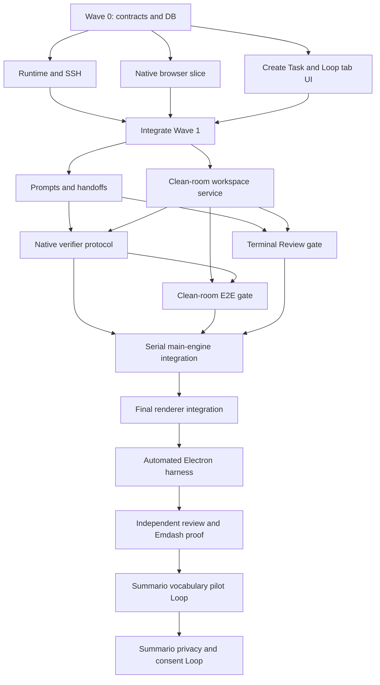
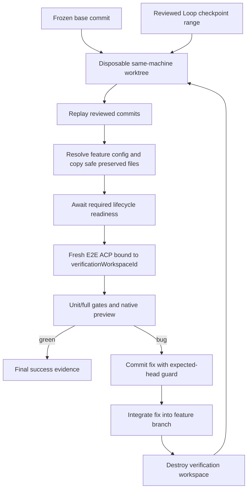

# ACP Loops v2: Codex Multi-Agent Execution Plan

This is the authoritative execution plan for finishing ACP Loops v2. It is a living document.
The lead Codex orchestrator is the only writer of the `Progress`, `Surprises & Discoveries`,
`Decision Log`, and `Outcomes & Retrospective` sections.

For a concise handoff prompt and wave map, start with
[`acp-loops-v2-codex-handoff.md`](./acp-loops-v2-codex-handoff.md), then return here for all
implementation contracts.

The implementation base inspected while writing this plan is `loops/acp-loops` at
`b35f0a42b2c2001b867d7c537b2a3781a3bee268`. Re-resolve and record the actual base before
starting; never assume that this SHA is still current.

## Prompt to give the lead Codex orchestrator

> Execute `docs/plans/acp-loops-v2-codex-orchestration.md` as a living ExecPlan. Read the entire
> file, root `AGENTS.md`, and every routed agent document before editing. Use GPT-5.6 Sol for the
> root session and every implementation, test, review, integration, and dogfood subagent,
> including simple or mechanical tasks. Verify the model before spawning work; if GPT-5.6 Sol is
> unavailable, stop and report that blocker rather than substituting another model. Create one
> Git worktree and branch per implementation lane, assign files exclusively, use failing tests
> first, and merge only through the lead integration worktree. Keep this plan's progress and
> decision sections current. Prefer the smallest adapters around existing Emdash services; reject
> duplicate workspace, SSH, worktree, preview, browser, task-tab, or orchestration systems. Do not
> use Agent Browser. Use Emdash's built-in browser preview. Do not push, publish, open a PR, deploy
> user/production artifacts, or touch the user's unrelated dirty worktrees. The only deployment
> authorized by this plan is the isolated non-production Summario verification backend lifecycle
> specified below. Continue through the final independent clean-room E2E gate; report success only
> after the recreated run is green.

## Model invariant

The requested execution model label is **GPT-5.6 Sol**. It applies to the orchestrator and every
child role without a lower-cost exception for small work.

Model selection is a caller-side prerequisite. Before creating branches or changing files, the
human or automation launching the root task and the orchestrator must:

1. Resolve the exact catalog model ID corresponding to the `GPT-5.6 Sol` label in the active Codex
   model catalog before launching the root task.
2. Configure the root `model`, `review_model`, and every agent-role config or spawn request to that
   same ID. The caller's config/spawn metadata is enforcement evidence; a child's self-reported
   model string is not.
3. Confirm centrally that the available spawn mechanism either sets that model per child or
   inherits the verified root model unchanged. If the spawn API exposes neither guarantee, stop
   before creating branches.
4. Record the resolved model ID, the caller-side config/profile, and the inheritance/spawn evidence
   in `Progress`.
5. Repeat the model requirement in every child prompt for defense in depth.
6. Resolve the same catalog ID through Emdash's **Codex ACP provider** for every real Loop used in
   execution or dogfood. Persist provider and model together in the Loop's versioned config and
   pass the model through the existing `ConversationConfig.model` path for work, Review,
   browser-verification, and E2E sessions.
7. Stop if the label is unavailable or cannot be enforced. Never silently downgrade.

Codex supports a root `model`, a `review_model`, and per-role agent config files. The exact
`GPT-5.6 Sol` label is a user-specified target and must be resolved against the executor's model
catalog rather than guessed or hardcoded. See the official
[Codex configuration reference](https://learn.chatgpt.com/docs/config-file/config-reference#configtoml).
Emdash already persists `ConversationConfig.model`; `AcpSessionManager` forwards it and the ACP
runtime reapplies it on fresh sessions. Reuse that path. The provider/model pair is one invariant:
`provider = 'codex'` and `model = <resolved GPT-5.6 Sol catalog ID>` for this execution. Do not pass
that ID to Claude, add a second model-selection transport, choose a different review model, or fall
back to a provider default for Loop sessions.

## Source-of-truth order

Use these sources in this order when they conflict:

1. This plan's resolved product and orchestration decisions.
2. The closest applicable `AGENTS.md` plus repository safety and convention documents.
3. Current code and tests. Existing abstractions determine how the feature integrates.
4. The [Loops v2 Gist mockup](https://gist.github.com/luisKisters/24c72963acc96c4011dd1afed95646a4)
   for user journey only. Recreate it with native Emdash components and spacing, not its CSS.
5. [`docs/plans/acp-loops.md`](./acp-loops.md) as historical v1 context only. Its Agent Browser,
   local-`cwd`, per-phase review, separate modal/sidebar, and old Summario acceptance decisions are
   superseded here.

This document follows the living-plan ideas in OpenAI's
[Codex ExecPlan guidance](https://developers.openai.com/cookbook/articles/codex_exec_plans): keep
the plan restartable from this file, record discoveries and decisions, and prove observable
behavior rather than merely producing code.

## Required repository reading

Read these completely before the corresponding lane begins:

- `AGENTS.md`
- `agents/workflows/testing.md`
- `agents/workflows/worktrees.md`
- `agents/workflows/remote-development.md`
- `agents/conventions/ipc.md`
- `agents/conventions/main-patterns.md`
- `agents/conventions/renderer-patterns.md`
- `agents/conventions/typescript.md`
- `agents/conventions/ui-styling.md`
- `agents/conventions/versioned-schemas.md`
- `agents/risky-areas/database.md` before schema or migration work
- `agents/risky-areas/ssh.md` before remote execution work
- `agents/risky-areas/pty.md` before environment or session work

For Summario dogfood, distinguish the discovery checkout from the task worktree as defined in Wave
5. After Emdash provisions it, read `$SUMMARIO_WORKTREE/AGENTS.md`,
`$SUMMARIO_WORKTREE/docs/conventions.md`, its generated Convex guidance, and the files named in the
dogfood sections below. All edits and commands run in `$SUMMARIO_WORKTREE`; the dirty discovery
checkout is read-only evidence.

## Purpose and observable outcome

After this work, a user can enable ACP Loops in Experimental Settings, create a task, enable Loop
mode, paste or describe a goal, edit the normalized phases, and run them inside the task. The task
automatically uses its resolved local, project-SSH, or repository-instance workspace; the user
never chooses a second Loop environment. A BYOI task may run work phases, but clean-room E2E is
available only when its provider proves immutable same-machine Git-worktree capability.

Each work phase starts a fresh ACP session and receives a persisted artifact handoff instead of
prior chat history. Unit tests and selected checks gate progress. The optional terminal Review
phase runs once after all work phases. The optional independent E2E phase runs after Review when
both are enabled, recreates the feature from its pre-change base in a disposable same-machine
worktree, uses Emdash's built-in browser preview, fixes discovered bugs, and repeats from scratch.
Opening or publishing a PR remains an explicit user action.

The finished feature is default-off, modular, and inert when disabled. It has complete loading,
empty, error, pause, retry, reconnect, cancellation, and cleanup states and works on local and SSH
projects without weakening environment allowlists, path safety, or shell quoting.

## Current code orientation

The existing branch contains a useful v1 implementation, but several paths must be reshaped rather
than replaced wholesale.

### Task and workspace path to reuse

- `apps/emdash-desktop/src/main/core/tasks/operations/createTask.ts` exposes
  `prepareCreateTask`, `commitCreateTask`, and `finalizeCreateTask`. It already derives a new
  worktree's local or SSH placement from the project. A Loop-aware atomic create operation must
  compose these functions, not fork normal task creation.
- `apps/emdash-desktop/src/main/core/workspaces/resolve-task-workspace-target.ts` returns the
  canonical `{ workspaceId, path, machine }`. This complete value is the Loop execution source of
  truth.
- `apps/emdash-desktop/src/main/core/projects/create-project-provider.ts`,
  `project-provider.ts`, and `project-manager.ts` own local/SSH project capabilities.
- `apps/emdash-desktop/src/main/core/workspaces/workspace-bootstrap-service.ts`,
  `workspace-factory.ts`, and `workspace-registry.ts` provision and acquire task workspaces and
  construct the correct providers.
- `apps/emdash-desktop/src/main/core/projects/worktrees/worktree-service.ts` owns safe local and
  remote worktree operations.
- `apps/emdash-desktop/src/main/core/execution-context/types.ts`,
  `local-execution-context.ts`, and `ssh-execution-context.ts` own transport-neutral commands.
- `apps/emdash-desktop/src/main/core/workspaces/workspace-env.ts`, effective task settings,
  lifecycle services, and preserve-pattern safety own the supported environment model.

### Preview and browser path to reuse

- `apps/emdash-desktop/src/main/core/preview-servers/preview-server-service.ts` stores preview
  servers by project/workspace and already turns SSH preview ports into local forwarded URLs.
- `apps/emdash-desktop/src/main/core/browser/browser-webcontents-registry.ts` owns hardened,
  registered Electron `WebContents` and already supports screenshots and data cleanup.
- `apps/emdash-desktop/src/renderer/features/browser/browser-pane.tsx`,
  `browser-tab-provider.tsx`, and `browser-session-store.ts` own native task browser sessions,
  profiles, webview binding, and preview selection.
- `apps/emdash-desktop/src/renderer/features/tasks/task-tab-registry.tsx` is the task-tab
  extension point.

### Loop path to evolve

- Shared contracts: `apps/emdash-desktop/src/shared/core/loops/`
- Database: `apps/emdash-desktop/src/main/db/schema.ts` and generated Drizzle migrations
- Engine: `apps/emdash-desktop/src/main/core/loops/`
- Renderer: `apps/emdash-desktop/src/renderer/features/loops/`
- Create Task: `apps/emdash-desktop/src/renderer/features/tasks/create-task-modal/`
- Main integration: `apps/emdash-desktop/src/main/rpc.ts` and `src/main/index.ts`
- Renderer integration: `apps/emdash-desktop/src/renderer/App.tsx`, modal/view registries, and
  task-tab registry
- Default-off setting: `apps/emdash-desktop/src/main/core/settings/schema.ts`,
  `settings-registry.ts`, and
  `apps/emdash-desktop/src/renderer/features/settings/components/ExperimentalSettingsCard.tsx`

The present `loop-service.ts` resolves `TaskWorkspaceTarget` and then discards `workspaceId` and
`machine`, retaining only a `cwd`. CLI verifiers and Git diff consequently execute through local
Node child processes even for remote paths. ACP conversations already know how to route to SSH.
The fix is to retain the task target and use existing execution contexts, not to add a second SSH
stack.

The current Agent Browser verifier and per-work-phase review semantics are obsolete. Native
browser verification should use a Loop-local structured ACP action handshake: the verification
ACP turn requests one allowlisted browser action, Electron main applies it to the scoped built-in
webview, and the result is returned in the next turn until pass or failure. This is a small adapter
over ACP turns and `BrowserWebContentsRegistry`, not a general MCP or automation framework.

## Non-negotiable design decisions

- The product entity is a **task**. An external issue is optional `linkedIssue` metadata.
- A task has exactly one primary Loop. Preserve every legacy row by adding primary state: for each
  task, deterministically choose the most recently updated non-completed row, otherwise the most
  recently updated row, with ID as the stable tie-breaker. Mark all others non-primary and retain
  them as history. Add a partial unique constraint for future primary rows. Concurrent creation
  returns a typed conflict; replacing a primary Loop must be an explicit transaction, never an
  implicit delete.
- Workspace placement comes only from the resolved task target. There is no Loop local/remote
  selector and no local fallback for an unsupported remote capability.
- One Loop remains ordered. Do not run its phases concurrently in v2. Parallelism is used to build
  independent implementation lanes; phase ordering preserves deterministic handoffs and replay.
- Each work, Review, browser-verification, and E2E session is fresh. Persist artifacts and
  checkpoints, not chat history.
- Every implementation and dogfood Loop session uses the preflighted GPT-5.6 Sol catalog ID via
  the existing conversation model field. Reuse the native agent/model selector if UI is needed.
- Work phases produce Loop-owned local checkpoint commits. Loops never push them automatically.
- Terminal gates are independently selectable and ordered `work* -> Review? -> E2E?`.
- Review inspects and may correct the complete base-to-feature change once, after work phases.
- E2E is bound exclusively to `verificationWorkspaceId`. ACP, commands, files, preview, and
  browser must never fall back to the feature task's workspace.
- Browser verification uses Emdash's built-in preview and existing SSH forwarding. No Agent
  Browser CLI, target URL field, CDP port field, reverse tunnel, raw `executeJavaScript` RPC, or
  normal user browser profile.
- The experimental setting is a user-controlled default-off opt-in enforced by renderer and main.
  Turning it off safely pauses active Loops, aborts verification, cleans transient resources, and
  prevents automatic resume.
- UI follows native Emdash page, dialog, pane, field, loader, spacing, theme, accessibility, and
  `kind !== 'ready'` state-guard patterns. The Gist is a journey reference, not a style source.
- PR creation, pushing, deployments, and releases remain explicit user actions.

## Simplicity and deep-integration gate

Every child begins with a read-only code trace. Before writing a new abstraction, its handoff must
name the existing abstraction being reused and demonstrate the missing seam. The orchestrator
rejects a branch that duplicates environment selection, remote execution, worktree provisioning,
preview forwarding, browser sessions, task tabs, typed RPC/events, or ACP session management.

Preferred seams are:

- `prepareCreateTask` / `commitCreateTask` / `finalizeCreateTask`
- `resolveTaskWorkspaceTarget`
- `ProjectProvider`, `WorktreeService`, and `runtimeManager`
- `LocalExecutionContext` and `SshExecutionContext`
- `createWorkspaceFactory` and `workspaceRegistry`
- `PreviewServerService`
- `BrowserSessionStore` and `BrowserWebContentsRegistry`
- typed RPC/events and the task-tab registry

Prefer small adapters under `src/main/core/loops/`. Do not introduce hidden task kinds, a second
workspace model, a general workflow framework, a general browser automation framework, or new DB
tables when versioned state on existing Loop/phase rows is sufficient. A generic existing API may
be extended only when a failing test proves that a narrow Loop adapter cannot supply the needed
behavior.

## Orchestration model

Use one lead/integrator plus at most three active implementation agents. More simultaneous writers
increase merge risk without adding useful independence.



### Worktree and branch protocol

The lead creates a clean integration worktree from the recorded base. Each implementation lane
gets a separate worktree and branch cut from the integration SHA for its wave. Never assign two
agents the same worktree.

Use branch names like `codex/loops-v2-contracts`, `codex/loops-v2-runtime`, and
`codex/loops-v2-native-browser`. Use distinct scratch DBs, app user-data directories, ports, and
browser profiles. Parallel workers run focused tests only. Serialize dependency installation,
lockfile changes, Drizzle generation, full Electron runs, Docker SSH, and full-suite tests.

Each worker makes one or more narrow Conventional Commits and reports commit SHAs. Workers do not
merge, rebase other lanes, push, or open PRs. The lead reviews and cherry-picks in dependency order,
runs a focused gate after each pick, and cuts the next wave only from the new integrated SHA.

### Required child handoff

Every child returns:

```text
active model (informational; caller-side evidence is authoritative):
status:
commits:
files changed:
tests written first:
tests run and results:
existing abstractions reused:
new seam and why it was unavoidable:
loading/error/cleanup states covered:
security and local/SSH notes:
integration requests:
remaining risks or blockers:
```

The lead rejects scope creep. If a child discovers that an unowned shared file must change, it
stops at the boundary and reports the requested seam; the lead reallocates it explicitly.

## Wave 0: serial contract freeze

Only the `contracts` agent edits shared Loop schemas, DB schema, generated migrations, and migration
tests. This work merges before any implementation lane begins.

Owned files:

- `apps/emdash-desktop/src/shared/core/loops/loops.ts`
- `apps/emdash-desktop/src/shared/core/loops/loop-config.ts`
- `apps/emdash-desktop/src/shared/core/loops/loop-phase-criteria.ts`
- `apps/emdash-desktop/src/shared/core/loops/loopEvents.ts`
- `apps/emdash-desktop/src/shared/events/loopBrowserEvents.ts` and its shared action/lease schemas
- shared Loop tests and narrowly named new versioned schema modules
- `apps/emdash-desktop/src/main/db/schema.ts`
- the next migration produced by `pnpm run db:generate`, its generated metadata, fixtures, and
  migration test; record the generated number instead of assuming `0020`
- settings schema/registry tests only when needed to express the effective opt-in contract

Wave 0 must leave the existing engine and renderer source-compatible so every Wave 1 branch starts
from a buildable SHA. Make changes additive: keep deprecated v1 config readers/accessors and
verifier IDs until their owning later lane removes them; use optional/defaulted mapped fields for
new phase/primary/session data; and let old fixtures and direct `reviewEnabled`, `verifiers`, and
`agentBrowser` consumers compile unchanged. Migration may materialize new values, but TypeScript
consumers cannot be forced across the v2 boundary before their owner runs. If this cannot be done
additively, do not spawn Wave 1; the lead allocates and merges a serial compatibility integration
step first.

Write failing tests first, then freeze:

- `LoopPhaseKind = work | review | e2e`
- config v2 terminal gates and native browser-preview setting, with v1 reading/migration
- the selected ACP provider/model pair, with every execution and dogfood Loop fixed to
  `provider = 'codex'` plus the preflighted GPT-5.6 Sol ID and no per-stage fallback; change the
  new-Loop default from the branch's current `DEFAULT_LOOP_PROVIDER = 'claude'` to Codex while the
  v1 migration materializes Claude for historical rows that previously relied on the old implicit
  default, as well as preserving explicit historical provider values
- phase handoff/stage-result state and checkpoint commit
- an append-only Loop session-attempt ledger recording every work/Review/browser/E2E conversation
  ID and purpose, so retries never erase the guard or audit trail for an older conversation
- immutable Loop base commit and expected feature-head/checkpoint state
- explicit `LoopSessionTarget` data containing the non-secret workspace ID, path, and machine
  discriminator required to start a verification ACP session without normal task hydration
- cleanup/checkpoint state sufficient to resume or clean an interrupted verification workspace
- fixed terminal ordering for every Review/E2E toggle combination
- the fixed data-preserving primary-row migration policy stated in this plan and typed concurrent
  creation conflicts
- narrow browser action/event and lease messages shared by main and renderer:
  `request -> ready -> action/result -> close -> closed`, carrying `verificationRunId`, `browserId`,
  project/task/workspace IDs, disposable partition, and allowed preview origin

Do not store environment values, secrets, browser payloads, or large evidence in versioned DB JSON.
Evidence metadata points to bounded app-data artifacts.

Exit gate:

- shared schema tests pass
- migration and fixture tests pass
- v1 rows parse without behavior loss
- toggle ordering and duplicate/concurrent creation contracts are deterministic
- the full workspace/app typecheck passes against the still-present v1 consumers
- the lead records the contract commit SHA before spawning Wave 1

## Wave 1: three parallel vertical lanes

### Lane R: transport-neutral Loop runtime and CLI verifiers

This agent owns only Loop execution-target adapters and CLI verifier implementations.

Owned existing files:

- `apps/emdash-desktop/src/main/core/loops/verifiers/types.ts`
- `verifiers/common.ts`, `exec.ts`, `unit-tests.ts`, `gh.ts`, `vercel.ts`, and `convex.ts`
- their focused tests, excluding final registry wiring

Suggested new files:

- `apps/emdash-desktop/src/main/core/loops/runtime/loop-execution-target.ts`
- `runtime/loop-execution-target.test.ts`
- `runtime/loop-command-runner.ts`
- `runtime/loop-command-runner.test.ts`
- `apps/emdash-desktop/src/main/core/workspaces/resolve-task-workspace-target.test.ts`

The lane retains `{ workspaceId, path, machine }`, resolves the existing local or SSH execution
context, and makes availability checks, validation commands, Git diff, and CLI verifiers execute on
that target. It removes direct local `child_process` assumptions from Loop verifiers. Argument
arrays, abort, timeout, and bounded output behavior remain transport-neutral.

Validation and CLI verifier parity requires a mandatory bounded task-environment overlay on both
local and SSH targets. Recompute only the clean-room `EMDASH_*` values through the existing
`getTaskEnvVars` path and merge them with the execution context's existing approved environment
handling. Because `IExecutionContext` lacks this seam, Lane R exclusively owns the smallest
structurally compatible option addition to
`apps/emdash-desktop/src/main/core/execution-context/types.ts` and
`packages/core/src/exec/execution-context.ts` plus focused tests. Values never enter logs,
persistence, or command evidence. It must not create a second command abstraction.

Tests cover local/SSH parity, abort, timeout, output limits, non-zero exits, target root, delegated
quoting, and environment allowlist preservation. This lane does not edit `loop-service.ts`,
`phase-runner.ts`, the verifier registry, shared schemas, RPC, or renderer files.

### Lane B: native Emdash browser verification slice

This agent owns the narrow browser service, its app-owned renderer host, and browser registry
hardening. It does not own the Loop engine.

Owned existing files when changes are necessary:

- `apps/emdash-desktop/src/main/core/browser/browser-webcontents-registry.ts` and test
- `apps/emdash-desktop/src/main/core/browser/controller.ts` and existing browser security helpers
- `apps/emdash-desktop/src/renderer/features/browser/browser-tab-provider.tsx`
- `browser-pane.tsx`, `browser-session-store.ts`, and their tests

Suggested new files:

- `apps/emdash-desktop/src/main/core/browser/native-browser-verification-service.ts`
- `native-browser-verification-service.test.ts`
- `apps/emdash-desktop/src/main/core/loops/verifiers/native-browser-protocol.ts`
- `native-browser-protocol.test.ts`
- `apps/emdash-desktop/src/renderer/features/loops/loop-browser-host.tsx`
- `loop-browser-host.test.tsx`

The app-owned host survives task-view closure and project navigation and may mirror its state into
the task's Loop tab. The lead alone wires it into `renderer/App.tsx` after this lane merges. The
service selects previews through `PreviewServerService.listForWorkspace`: zero waits with timeout,
one selects automatically, and multiple use an explicit run association or return an actionable
ambiguity. SSH URLs are already forwarded; do not tunnel again.

Register browser ownership with project, task, workspace, browser ID, expected preview origins, and
a disposable verification partition. Expose only audited navigate, accessibility snapshot/query,
click, fill, keypress, screenshot, and redacted diagnostics actions. Never expose arbitrary JS,
external origins, cookies, auth headers, request bodies, filesystem URLs, or a normal user profile.

Consume, but do not edit, the Wave 0 request/ready/action/close lease schemas. The renderer sends
`ready` only after session registration, `WebContents` binding, and `dom-ready`. Main rejects an
action before readiness or after close. Cancellation and restart invalidate `verificationRunId`,
and the renderer acknowledges teardown. Extract a context-free hardened webview host from the
current `BrowserPane`; do not mount `BrowserPane` under `App.tsx`, because it depends on task-pane
and preview contexts.

An SSH preview reconnect may rotate the forwarded local port. Pause actions while reconnecting. If
the ready URL is identical, resume the lease; if its origin changes, close and acknowledge the old
lease, issue a new `verificationRunId`/browser lease bound to the new origin, and then resume. Never
mutate an active lease's allowed origin in place.

Use the structured ACP-turn action format frozen in Wave 0, but export only the parser, service,
prompt fragment, and renderer lifecycle. Final PhaseRunner wiring belongs to the integration lane.
Tests cover malformed/oversized actions, identity and origin isolation, webview bind/teardown,
request/ready/action/close races, task-view closure, project switching, hidden host lifetime,
ready/loading/reconnecting/failed states, SSH forwarding, cancellation, artifact path safety, and
redaction.

### Lane U: Create Task authoring and native Loop task tab

This Wave 1 agent builds renderer authoring components and the Loop tab behind an injected
renderer-local port. It does not wire nonexistent RPC methods or edit main, DB, shared contracts,
Create Task, task registries, or the task manager yet.

Owned files:

- `apps/emdash-desktop/src/renderer/features/loops/`, except the browser host owned by Lane B and
  production registry/RPC wiring reserved for the final renderer lane
- focused renderer tests using an injected fake authoring port

Suggested new files:

- `features/loops/create-task-loop-section.tsx`
- `features/loops/loop-plan-model.ts` and test
- `features/loops/loop-authoring-port.ts`
- `features/loops/loop-tab-provider.tsx`
- `features/loops/loop-tab-resource.ts`

Build the flag-gated Loop section, goal/pasted-plan input, editable phases, and independently
selectable Review/E2E toggles displayed in fixed order. V2 normalization is deliberately
deterministic before task creation: parse Markdown headings, numbered items, and checkbox items into
work phases; when no structure is present, create one editable phase from the goal. Do not start a
hidden ACP/model session before the task exists. Parsing is synchronous; loading state belongs to
the later atomic task/workspace creation path, while parse/validation errors remain editable.

Define `LoopAuthoringPort` locally and test components with a fake. Do not reference future
`rpc.loops.normalizePlan` or `createTaskWithLoop` methods. Production RPC and task-manager wiring is
deferred until the main engine endpoints exist.

Build one Loop tab provider/resource showing phases, handoffs, evidence, browser state,
pause/resume, retry, and actionable failures. Reuse native components, tokens, page/pane width, and
padding. Do not copy Gist CSS. Registry insertion and retirement of old entry points happen only in
the final renderer integration lane.

Tests cover deterministic parsing/fallback, default values, terminal order, editable invalid input,
tab resource state, accessibility, pause/retry presentation, and event/store mapping through the
fake port.

## Wave 2A: parallel clean-room and prompt foundations

Cut both lanes from the integrated Wave 1 SHA.

### Lane W: clean-room workspace service

Prefer new files under `apps/emdash-desktop/src/main/core/loops/clean-room/`:

- `clean-room-workspace-service.ts` and test
- `feature-snapshot-service.ts` and test when separation is demonstrably useful

Compose `ProjectProvider`, `WorktreeService`, `runtimeManager`, `createWorkspaceFactory`, and
`workspaceRegistry`. Capture and validate the base and expected feature commit, preflight worktree
capability, and use this exact order: create the generated worktree at the frozen base; replay the
reviewed checkpoint range; resolve the feature-version `.emdash.json` and effective settings; copy
only configured safe preserved files; acquire the workspace; await mandatory setup readiness and,
when configured by the project/E2E browser gate, run and preview readiness; test; then teardown
deterministically.

Local and project-SSH/repository-instance targets are required. BYOI proceeds only when its provider
can create and acquire an immutable Git workspace on that same machine. Otherwise the capability
preflight returns a visible, actionable `unsupported-clean-room` result. It never falls back local
or claims parity.

Expose narrow create/replay/integrate-fix/recreate/destroy operations. Add a small path-safe
`WorktreeService` method only if its current API cannot create a worktree at an immutable commit;
Lane W then receives exclusive ownership of that method and its tests. Do not hand-build paths, use
raw `git worktree` shell strings, invoke `rm -rf`, or copy `WorkspaceFactory` behavior.

`WorktreeService.copyPreservedFiles()` is currently private, while feature-version preserve rules
must be applied after replay. Lane W therefore also exclusively owns the smallest path-safe public
`copyPreservedFilesToWorktree()` operation and focused tests, or folds precisely that behavior into
the immutable-worktree operation. Reuse the existing validation/copy implementation; do not
duplicate its traversal and symlink protections. Unlike the legacy log-and-skip helper, the
clean-room call returns a typed strict `Result`: safely excluded patterns remain exclusions, but a
required source, glob, or copy failure blocks parity and names the missing preserve requirement
without exposing file contents.

Workspace acquisition is not readiness: `createWorkspaceFactory()` currently starts lifecycle work
from a fire-and-forget side effect. Lane W therefore receives exclusive ownership, if the failing
test proves it necessary, of a narrow awaitable startup receipt in
`apps/emdash-desktop/src/main/core/workspaces/workspace-lifecycle-service.ts` and test plus the
minimal wiring in `workspace-factory.ts`. Setup readiness is mandatory. When a run script or native
browser check is configured, the receipt additionally resolves only after the long-lived run
command reaches a confirmed started/running state and the expected preview passes readiness; a
CLI-only Loop with neither requirement does not wait for a URL. It never waits for a dev server to
terminate. Early required-run exit, preview timeout, cancellation, or setup failure returns a typed
failure; normal task startup behavior remains compatible.

Tests use temporary repositories and fake local/SSH providers for base pinning, commit validation,
linear replay, feature-version config resolution, preserved-file safety, required setup/run/preview
readiness and failure, abort/crash cleanup, remote-machine identity, BYOI capability blocking,
optimistic feature-head checks, fix integration, and full recreation.

### Lane P: prompts and artifact handoffs

Owned files:

- `apps/emdash-desktop/src/main/core/loops/prompt-builder.ts` and test
- new `handoff-builder.ts` and test
- new dedicated Review/E2E prompt modules and tests when that keeps prompts smaller

Work prompts require TDD. Each phase receives the goal, acceptance criteria, base/checkpoint
metadata, prior persisted summary, evidence, risks, and remaining work—not chat history.

The terminal Review prompt covers correctness, unnecessary verbosity/complexity, duplication,
repository conventions, modular experimental isolation, security, local/SSH parity, loading/error
states, tests, specifications, documentation, and dead code. It may fix findings and create a new
checkpoint.

The E2E prompt is explicitly independent, bound to the clean-room target, allowed to correct bugs,
and instructed to retain intermediate failures as evidence while reporting success only after a
fresh green replay. Browser wording uses the native structured action protocol, not Agent Browser.
This lane does not edit runners, services, drivers, or registries.

## Wave 2B: parallel Review and native-verifier modules

After W and P merge, run Lanes V and N in parallel. Neither edits `PhaseRunner`.

### Lane V: terminal Review gate

Own new `apps/emdash-desktop/src/main/core/loops/gates/review-gate.ts` and test. It starts one fresh
Review session after all work phases, reviews `baseCommit..checkpointCommit`, can fix issues, reruns
the required gate, and returns a typed stage result/new checkpoint.

### Lane N: native browser verifier handshake and evidence

Own the final `native-browser.ts` verifier and test plus a Loop evidence store under
`src/main/core/loops/evidence/`. Consume without editing Wave 0's shared lease/action schemas and
Lane B's protocol parser/service. Combine ACP turns with Lane B's local Electron service: request
one allowlisted action, apply it, return bounded/redacted observations, and repeat until an honest
pass/failure sentinel.

`LoopSessionTarget` is required in `VerifierRunContext` and every `startVerificationSession` call.
Every nested browser-verification conversation receives the verification workspace ID, path,
machine, and recomputed trusted task environment explicitly; it may never default back to the
feature task merely because the outer E2E conversation is correctly targeted.

Evidence lives in app data, not the repository or clipboard. Apply bounded retention and cleanup.
Screenshots are sensitive artifacts. This lane does not edit generic ACP runtime or create MCP or
network bridges.

## Wave 2C: clean-room E2E gate after native verifier merges

### Lane E: clean-room E2E gate

Own new `apps/emdash-desktop/src/main/core/loops/gates/clean-room-e2e-gate.ts` and test. It consumes
the already merged Lanes W and N, creates a fresh E2E session targeted only at
`verificationWorkspaceId`, and runs full tests plus native preview verification. Do not start Lane
E in parallel with Lane N.

When a bug is found, commit the fix in the verification worktree, confirm the feature branch still
matches the expected head, integrate the fix without overwriting concurrent work, destroy the clean
room, recreate from the frozen base, replay the complete range, and rerun. Use a bounded attempt cap
and return an honest failure when exhausted.

## Wave 3A: serial main-engine integration lane

One GPT-5.6 Sol integration agent owns all orchestration hotspots after service-level branches are
ready:

- `apps/emdash-desktop/src/main/core/loops/loop-service.ts` and test
- `phase-runner.ts` and test
- `drivers/session-driver.ts`, `acp-driver.ts`, driver registry, prompt timeout, and tests
- `operations/loop-operations.ts`, `operations/types.ts`, and tests
- `verifiers/registry.ts` and test
- `controller.ts`
- `apps/emdash-desktop/src/main/rpc.ts`
- Loop initialization in `apps/emdash-desktop/src/main/index.ts`
- `apps/emdash-desktop/src/main/core/settings/controller.ts` and focused tests for live disable
- the Loop-aware atomic task-create operation under `src/main/core/loops/operations/`
- the narrow verification-session/environment seam, with exclusive ownership of:
  - `packages/core/src/acp/runtime.ts`
  - `packages/core/src/acp/acp-session-runtime.ts` and tests
  - `packages/core/src/acp/acp-agent-connection.ts` and tests when process provisioning requires it
  - `apps/emdash-desktop/src/main/core/acp/acp-session-manager.ts` and tests
- `apps/emdash-desktop/src/main/core/conversations/hydrateConversation.ts` and focused
  tests, plus only the minimal Loop-purpose lookup needed by its guard

Replace `review: boolean` session context with a purpose and optional explicit session target.
For E2E, create the conversation on the original task so it remains visible in task history, but do
not call normal `hydrateConversation` for that session. Start `acpSessionManager` directly with the
persisted non-secret verification workspace ID/path/machine. The process pool is isolated by the
unique workspace ID. On restart, mark the interrupted verification attempt and create a new E2E
conversation/session deterministically. Append every attempt to the Wave 0 session ledger rather
than overwriting only `LoopPhase.conversationId`. `hydrateConversation` consults that durable
purpose lookup so every historical E2E conversation is recognized and normal hydration returns an
actionable typed rejection; an old E2E conversation must never open against the feature task's
normal workspace.

Add the mandatory bounded trusted task-environment overlay to `AcpStartInput`: recompute the
clean-room `EMDASH_*` task variables through the existing `getTaskEnvVars` path and merge only
those approved values with the existing allowlisted provider environment. Do not persist or log
values. Test local and SSH spawning and prove that disallowed Electron process variables do not
leak. Every new conversation also passes the Loop's selected model through the existing
`createConversation`/`ConversationConfig.model` path.

The atomic create operation composes task preparation/commit/finalize plus Loop inserts in one DB
transaction, then runs existing task-created side effects after commit. Do not put Loop config into
normal task creation or add a hidden task kind.

The engine enforces:

- authoritative effective opt-in in every RPC/startup/resume/background path
- full target retention and transport-neutral verification
- one fresh session per stage and persisted handoff
- unit-test-first work verification
- optional Review once after all work
- optional clean-room E2E once after Review when both are selected
- crash-safe persisted transitions and deterministic cleanup
- pause/cancel/flag-off abort propagation
- no automatic push, PR, deployment, or release

Extend the existing settings controller's `reconcileSettingsRuntimeState('experiments')` path to
call a narrow Loop enabled-state reconciliation method after update/reset. Do not invent a second
settings event bus.

Delete the Agent Browser verifier and obsolete UI paths only after native equivalents pass. Run the
order matrix for neither gate, Review only, E2E only, and both. Test fresh conversation IDs,
atomic rollback, flag-off rejection, restart recovery, local/SSH target propagation, browser
handshake, clean-room binding, and all cleanup exits.

## Wave 3B: serial final renderer integration lane

After the main endpoints are real, the UI owner rebases its Wave 1 work and exclusively owns final
renderer integration:

- `apps/emdash-desktop/src/renderer/features/tasks/create-task-modal/create-task-modal.tsx`
- `use-create-task-state.ts`, `use-create-task-callback.ts`, `build-create-task-params.ts`, and tests
- `apps/emdash-desktop/src/renderer/features/tasks/stores/task-manager.ts` and test only if the
  returned task/Loop result needs a narrow insertion seam
- `apps/emdash-desktop/src/renderer/features/tasks/task-tab-registry.tsx`
- `apps/emdash-desktop/src/renderer/features/tasks/view/task-sidebar.tsx`
- `apps/emdash-desktop/src/renderer/app/modal-registry.ts` and `view-registry.ts`
- `apps/emdash-desktop/src/renderer/App.tsx` for Lane B's app-owned browser-host mount
- `apps/emdash-desktop/src/renderer/features/settings/components/ExperimentalSettingsCard.tsx`
- all production adapters/stores under `renderer/features/loops/`

Implement `LoopAuthoringPort` with the real typed RPC. When Loop mode is enabled, suppress the
normal initial-conversation prompt so task provisioning cannot launch a second non-Loop agent next
to work phase 1. Call the atomic `createTaskWithLoop`, feed its returned task through the same
TaskManagerStore insertion/provision/navigation path as ordinary task creation, open the pinned Loop
tab, and keep pending/failure rollback visible. When Loop mode is off, the existing create path is
unchanged.

Retire the separate modal/sidebar/standalone view only after the new path passes. The main-engine
agent does not edit renderer files, and the renderer agent does not edit main endpoints.

## Wave 3C: automated Electron integration harness

One serial GPT-5.6 Sol test-harness owner adds the smallest executable Electron proof, because the
Vitest browser project runs Chromium and cannot prove Electron `<webview>` behavior. Prefer the
already installed Electron and Playwright primitives; add a direct dev dependency only if the lead
approves serialized lockfile ownership.

Suggested ownership:

- new `apps/emdash-desktop/tooling/loops-electron/` harness and specs
- the minimal app `package.json` script, named `test:loops-electron`
- test-only fixtures/config required to launch an isolated app DB and user-data directory

The command must launch the real Electron app and automatically prove host request, session
registration, `WebContents` bind, `dom-ready` acknowledgement, scoped action, cancellation, and
teardown against a local preview. A second deterministic target runs through the Docker SSH setup
and proves the forwarded preview, including pause plus lease rotation when the SSH forward returns
a different local origin. Manual clicking may supplement this command but cannot replace it.

Merge order is contracts, runtime/browser/UI foundations, clean-room/prompts, Review/native
verifier, E2E gate, main engine, final renderer, Electron harness, then independent review. Run
focused tests after every cherry-pick.

## Conflict ownership matrix

| Hot files | Exclusive owner |
| --- | --- |
| shared Loop/browser schemas, DB schema, generated migration and metadata | contracts lane |
| existing CLI verifier implementations and execution contexts | runtime lane |
| browser registry/provider/pane, context-free host, protocol parser/service | native browser lane |
| Create Task, task manager seam, task registry, App host mount, renderer Loop UI/store | UI lane |
| `prompt-builder.ts` and handoff prompts | prompts lane |
| exact-commit WorktreeService and awaitable lifecycle seams | clean-room lane, when approved |
| `loop-service.ts`, `phase-runner.ts`, settings reconcile, main RPC/index, verifier registry, ACP target/env seam | main integration lane |
| package lockfile, full dev servers, Convex codegen/deploy | lead/integrator, serialized |
| Electron harness and its package script | Electron harness lane, serialized |

No child edits a row it does not own. Read access is unrestricted and encouraged.

## Test-driven development and merge gates

Each lane demonstrates a failing test before production changes, implements the smallest passing
slice, then refactors. A handoff without the red/green evidence is incomplete.

Focused coverage must include:

- v1-to-v2 config and migration behavior
- one-primary and concurrent-create behavior
- all terminal ordering combinations
- local and SSH target parity
- environment overlays without secret leakage
- validation/Git diff on the actual task machine
- native browser identity/origin/action restrictions
- browser preparing/loading/reconnecting/failed/cancel states
- app-owned host lifetime across view/project changes
- diagnostics and screenshot artifact handling
- Review exactly once over the complete change
- clean-room immutable base and linear replay
- preserved files, lifecycle readiness, teardown, restart recovery
- bug integration followed by mandatory destruction/recreation
- concurrent feature-head drift refusal
- native Electron browser behavior on local and Docker-backed SSH preview

From the Emdash repo root, the serial merge gate is:

```bash
pnpm run format
pnpm run lint
pnpm run typecheck
pnpm run test
pnpm --dir apps/emdash-desktop run test:loops-electron
```

Before Wave 3C, run the first four commands; the Electron command does not exist yet. Once the
harness lands, it becomes mandatory for Wave 3C and every later full gate.

Schema changes additionally run from `apps/emdash-desktop/`:

```bash
pnpm run db:generate
pnpm run db:fixtures
pnpm run test:migrations
```

Never hand-edit numbered Drizzle migrations or metadata. The final native proof command includes a
local Electron run and the repository's Docker SSH setup. Do not substitute renderer-only browser
tests, manual clicking, or Agent Browser for the native preview path.

## Wave 4: independent code review and Emdash proof

A fresh GPT-5.6 Sol reviewer who implemented none of the lanes first performs a read-only review of
the complete base-to-head diff. It checks the resolved behavior, excessive complexity, duplicate
abstractions, repo conventions, experimental isolation, security, environment handling, loading
states, tests, docs, and local/SSH parity. Findings are assigned to the owning lane or integrator;
the reviewer does not create a competing rewrite.

After fixes, rerun the entire merge gate and repeat review. The reproducible driver is
`test:loops-electron`; the implemented native Loop action service later drives Summario content.
Manual observation is supplementary. Verify:

1. With the experiment off, verify no Loop UI, RPC starts, resume, or background work occurs.
2. Create a local task with Loop mode and complete a small two-phase change.
3. Verify the native browser host through an automatically detected local preview.
4. Repeat on the Docker-backed SSH project and prove commands, ACP, Git diff, preview forwarding,
   browser actions, cancellation, and cleanup stay on the remote target.
5. Test Review/E2E toggle combinations and visible loading/error/reconnect states.
6. Interrupt and restart during work and verification, then prove safe resume or cleanup.

Do not begin Summario dogfood until this gate is green.

## Wave 5: Summario custom-vocabulary pilot Loop

Set `$SUMMARIO_SOURCE_REPO` to the discovered source checkout; the inspected checkout was
`/home/devuser/projects/summario`. It is read-only discovery evidence because it is dirty and
divergent. Fetch there without changing its files, choose an approved clean base (the relevant
files matched `origin/main` at `ab6cd7ec962e` when inspected), and let Emdash create the task
worktree. Set `$SUMMARIO_WORKTREE` to that Emdash-provisioned task workspace and record its actual
path and base SHA. Every edit, test, codegen, deploy, preview, Review, and E2E command below must
run from `$SUMMARIO_WORKTREE`, never `$SUMMARIO_SOURCE_REPO`. Resolve a new worktree variable for
the separate Wave 6 task.

The untracked Summario `.emdash.json` currently preserves `.env.local` and runs
`pnpm install --prefer-offline`. Do not commit or copy `.emdash.json` unsafely. The Loop must carry
the already resolved effective settings and approved preserve behavior into clean-room verification.
Convex deployment environment is separate mutable state; `.env.local` alone is insufficient.
Preflight a dedicated non-production verification deployment whose frontend URL and server
environment agree. Supply `AGENT_LOGIN_PASSWORD`, `GOOGLE_GEMINI_API_KEY`, required URLs, and the
guarded fixture flag through approved secret/environment stores without printing them or
persisting them in repository files, Loop DB state, logs, prompts, or evidence. A caller-owned
ephemeral mode-0600 projection outside those locations is permitted only for CLI provisioning and
must be deleted on every success, failure, cancellation, and crash-recovery exit. Never use
production fixtures.

### Dogfood backend and authentication prerequisite

The clean base has no backend reset/provisioning script, and `convex import --replace-all` does not
prove storage-blob, auth, environment, or scheduled-state cleanup. The lead, not an implementation
child, therefore exclusively owns one backend lease at a time.

For the inspected local Summario project, the default is a brand-new local Convex deployment inside
each disposable clean-room worktree. The replayed branch must ignore `.convex/` in its tracked
`.gitignore`; it is never preserved or committed. Before the initial backend can precede that
tracked fix, the lead resolves and inspects `git rev-parse --git-path info/exclude`, adds an
idempotent `.convex/` entry, records whether this run added it, and removes only that run-owned line
during teardown. On **every** creation or
recreation, first assert that `.convex/` is absent, select a new local deployment, provision its
environment, then supervise the long-running backend:

```bash
test ! -e .convex
pnpm exec convex deployment create local --select
pnpm exec convex env set --from-file "$SUMMARIO_CONVEX_ENV_FILE"
pnpm exec convex dev --tail-logs disable
```

The final command is a lifecycle-managed process, not a command that must exit. Wait for its
codegen/deploy readiness before starting Next.

`$SUMMARIO_CONVEX_ENV_FILE` is a mode-0600, caller-provided **ephemeral projection** outside the
repository and evidence directory. It targets only this non-production deployment and contains the
approved server values; it is never copied, displayed, or passed to ACP. After Emdash reports the
canonical native-preview origin, set only the app-origin values—`NEXT_PUBLIC_APP_URL` in the
disposable worktree and Convex `SITE_URL`—to that origin. `NEXT_PUBLIC_CONVEX_URL` remains the
Convex URL written by `deployment create`; never replace it with the Next/native-preview URL. Wait
for backend/frontend readiness again and prove neither origin targets production before enabling
`SUMMARIO_BROWSER_FIXTURES=local` or login.
The preflight must also prove fresh Convex Auth initialization is non-interactive and that
`AGENT_LOGIN_PASSWORD` plus `GOOGLE_GEMINI_API_KEY` are present. If auth setup asks for undocumented
interactive input, stop rather than reuse another deployment.

For an SSH-hosted Summario task, local Convex qualifies only when the existing Emdash forwarding
stack proves both its HTTP and WebSocket endpoints resolve from the Electron preview. Otherwise a
human/project administrator must authorize fresh non-production cloud deployments, provide team
and project identity plus a non-production-only authenticated CLI context, approved secret
projection, quota, and expiry. Each attempt then uses a unique ref:

```bash
pnpm exec convex deployment create \
  "${SUMMARIO_CONVEX_TEAM}:${SUMMARIO_CONVEX_PROJECT}:dev/emdash-${LOOP_RUN_ID}-${ATTEMPT}" \
  --type dev --expiration "in 1 day" --select
pnpm exec convex env set --from-file "$SUMMARIO_CONVEX_ENV_FILE"
pnpm exec convex dev --once --typecheck enable --tail-logs disable
```

The installed CLI cannot mint deployment-scoped creator credentials; an administrator supplies and
verifies the non-production-only credential externally. Never reuse the personal dev deployment,
select production, or call a cloud deployment “reset.” If identity, credential, forwarding, quota,
expiry, or any other cloud prerequisite is unavailable, block remote dogfood with the missing
capability named.

Authenticated native-preview E2E uses the existing `/auth/agent-login` password form in a new
disposable browser partition. Human pre-auth is a mandatory external prerequisite for every fresh
attempt: before ACP turns or evidence capture begin, the lead pauses and the human enters the
password into `#agent-password`. Never put the password in a URL, action payload, ACP prompt, log,
screenshot, or evidence record. Clear bounded browser action history, navigate away from the form,
and begin evidence only after the agent test user is visibly authenticated. If human pre-auth is
unavailable, authenticated dogfood is blocked rather than presented as autonomous or downgraded.

At teardown, delete task-owned templates/meetings through authenticated product or guarded fixture
cleanup paths. The lead redirects `convex data --deployment <lease> --limit 1 --format jsonArray`
for `templates`, `meetings`, `shareLinks`, `meetingSeries`, `oauthTokens`, and `driveExports` into a
mode-0700 temporary audit directory outside the repo, records only per-table empty/non-empty
booleans, then removes that directory and the ephemeral secret projection. Any feature-owned
residual marks cleanup failed. For local mode, stop Next and the supervised `convex dev`, prove no
child remains, and let normal clean-room destruction remove the worktree and its `.convex/`
database/file storage, then remove only the Git exclude entry this run added. The table booleans
prove only fixture hygiene; they do not prove auth tables, `_storage`, scheduled functions, or the
deployment are empty. For cloud mode, independence comes from never reusing the lease and waiting
for expiry, not from that audit: the inspected CLI has no delete command, so the one-day expiration
is the cleanup boundary. A failed attempt's backend is never reused; the next recreation gets a new
one. If policy requires immediate cloud destruction, stop until an approved external deletion
capability exists.

Run this implementation through one real Loop, with ordered fresh sessions:

### Pilot phase 1: backend extraction contract

Primary files:

- `$SUMMARIO_WORKTREE/.gitignore` for the required `.convex/` generated-state exclusion
- `$SUMMARIO_WORKTREE/convex/vocabularySuggestions.ts`
- `$SUMMARIO_WORKTREE/convex/lib/vocabularySuggestions.ts`
- `$SUMMARIO_WORKTREE/convex/lib/vocabularySuggestions.test.ts`
- `$SUMMARIO_WORKTREE/convex/vocabularySuggestions.integration.test.ts`
- `$SUMMARIO_WORKTREE/convex/vocabularyFixtures.ts` and
  `$SUMMARIO_WORKTREE/convex/vocabularyFixtures.test.ts` for the narrow guarded browser fixture

Create an authenticated, ownership-checked suggestion path from the template's persisted
`exampleProtocol`. Return only normalized/deduped `customVocabulary`; member-name extraction is out
of scope. Preserve current term count/length limits and manual terms. Disabled means no request.
Tests cover authorization and cross-user rejection, empty examples, Gemini request/response shape,
malformed output, normalization, limits, deduplication, and manual-term preservation. Keep this in
the existing vocabulary-suggestion domain; do not move it into final template generation, which
runs after the Details step. Follow the existing fixture convention with a deterministic
agent-test-user seed/cleanup pair that refuses unless `SUMMARIO_BROWSER_FIXTURES` is `local` or
`test`. Only the conjunction of that flag, the agent-test-user identity, and a fixture-owned
template may substitute a deterministic provider response, which still traverses the production
normalization/deduplication path; tests prove every other identity/input calls or rejects through
the normal path. Deterministic native E2E uses this seam, while a live-Gemini smoke is supplemental
and never the only pass criterion.

### Pilot phase 2: Template setup UX

Primary files:

- `$SUMMARIO_WORKTREE/components/templates/TemplateSetupForm.tsx`
- `$SUMMARIO_WORKTREE/components/templates/steps/ExampleStep.tsx`
- `$SUMMARIO_WORKTREE/components/templates/steps/InstructionsStep.tsx`
- new pure `$SUMMARIO_WORKTREE/lib/templateSetupDraft.ts`
- new `$SUMMARIO_WORKTREE/lib/templateSetupDraft.test.ts`

Add a default-on “Suggest custom vocabulary from this example” switch to the Example step. Persist
it in the existing wizard/session draft so back navigation and OAuth round-trips do not reset it.
When advancing, show a specific loading/error/retry state and prefill editable Custom vocabulary
chips in Details. Failure is non-destructive and manual setup can continue.

`TemplateSetupDriveDraft` currently uses literal version 1. Extract only its pure versioned
serialize/restore/default logic into `lib/templateSetupDraft.ts` and keep the component as its
caller. Older drafts without the new field restore with suggestions enabled, rather than being
discarded or restored as disabled. The exact `lib/templateSetupDraft.test.ts` suite is included by
the clean base Vitest configuration and covers v1 restore, new-version save/restore, missing and
corrupt fields, and the default-on invariant. Component/native-preview acceptance covers OAuth
round-trip, backward navigation, and retry; do not claim a Playwright unit test when that harness
is absent from the selected base.

### Pilot phase 3: completed-Meeting cleanup and docs

Primary files:

- `$SUMMARIO_WORKTREE/components/meeting/status-views/SummaryEditorView.tsx`
- `$SUMMARIO_WORKTREE/app/meeting/[meeting_id]/page.tsx`
- remove `$SUMMARIO_WORKTREE/components/meeting/VocabularySuggestionsPanel.tsx` after reference audit
- old meeting-specific Convex endpoints only when unreferenced
- `$SUMMARIO_WORKTREE/README.md`, `$SUMMARIO_WORKTREE/docs/product.md`, and
  `$SUMMARIO_WORKTREE/docs/architecture.md` where claims changed

Remove the vocabulary-suggestion entry point from summarized/approved Meetings. Reuse the existing
normalization library where appropriate; do not delete backend code until references and generated
API use are audited.

Then run the terminal Review and independent E2E phases. Acceptance covers default-on, opt-out,
loading/failure/retry, editable/removable suggestions, persistence, manual-term preservation, edit
flow, absence from completed Meetings, and continued transcription-context use. Run `pnpm test`,
`pnpm exec tsc --noEmit`, `pnpm lint`, and `pnpm build`. Use Emdash's native preview; use project
Playwright only if its harness exists on the selected base rather than silently importing the dirty
28-commit harness branch.

Every recreated pilot clean room follows the fresh local-or-expiring-cloud lease contract above,
deploys the replayed commit, seeds only the guarded vocabulary fixture, and proves cleanup. Reusing
state from a failed attempt is not an independent rerun.

## Wave 6: Summario privacy and consent acceptance Loop

Use a separate Summario task, Loop, branch, clean base, isolated backend, and browser profile. Do
not base it on the pilot branch unless the pilot has landed on the selected base. Re-resolve and
record `$SUMMARIO_WORKTREE` as this second Emdash-provisioned workspace; the Wave 5 value is stale.
The backend lease and secret-safe authentication prerequisite above applies independently to every
Wave 6 recreation.

The first phase inventories and obtains approved facts for controller entity/address/contact,
jurisdiction, effective date, retention, deletion guarantees, legal bases, subprocessors, purposes,
and actual optional technologies. It must inspect these exact truth-source seams at minimum:

- `$SUMMARIO_WORKTREE/convex/schema.ts`
- `$SUMMARIO_WORKTREE/convex/auth.config.ts`, `$SUMMARIO_WORKTREE/convex/auth.ts`,
  `$SUMMARIO_WORKTREE/convex/lib/auth.ts`, and `$SUMMARIO_WORKTREE/convex/http.ts`
- `$SUMMARIO_WORKTREE/components/providers/ConvexClientProvider.tsx` and
  `$SUMMARIO_WORKTREE/proxy.ts`
- `$SUMMARIO_WORKTREE/convex/meetings.ts` and
  `$SUMMARIO_WORKTREE/convex/lib/transcriptStorage.ts`
- `$SUMMARIO_WORKTREE/convex/cronActions.ts` and `$SUMMARIO_WORKTREE/convex/crons.ts`
- `$SUMMARIO_WORKTREE/convex/meetingSeries.ts`, `$SUMMARIO_WORKTREE/convex/templates.ts`,
  `$SUMMARIO_WORKTREE/convex/users.ts`, and `$SUMMARIO_WORKTREE/convex/errorReports.ts`
- `$SUMMARIO_WORKTREE/convex/skribbyActions.ts`,
  `$SUMMARIO_WORKTREE/convex/summaryActions.ts`, `$SUMMARIO_WORKTREE/convex/lib/skribby.ts`, and
  `$SUMMARIO_WORKTREE/convex/lib/gemini.ts`
- `$SUMMARIO_WORKTREE/convex/drive.ts`, `$SUMMARIO_WORKTREE/convex/driveActions.ts`, and
  `$SUMMARIO_WORKTREE/convex/lib/googleDriveDocs.ts`
- `$SUMMARIO_WORKTREE/convex/shareLinks.ts`, `$SUMMARIO_WORKTREE/app/share/[token]/page.tsx`, and
  `$SUMMARIO_WORKTREE/components/share/PublicShareClient.tsx`
- `$SUMMARIO_WORKTREE/components/landing/BookingButton.tsx`
- `$SUMMARIO_WORKTREE/components/ui/tui-editor.tsx`
- `$SUMMARIO_WORKTREE/docs/product.md`, `$SUMMARIO_WORKTREE/docs/architecture.md`, and
  `$SUMMARIO_WORKTREE/docs/runbook.md`
- `$SUMMARIO_WORKTREE/.env.example`, `$SUMMARIO_WORKTREE/package.json`, and
  `$SUMMARIO_WORKTREE/vercel.json`

Current code has no analytics integration. Do not build a banner whose buttons gate nothing. Audit
Cal.com loading and other real optional third-party behavior. Required storage and core meeting/editor
behavior must not depend on consent. If no optional technology requires consent, use the requested
banner as an accurate notice/preferences surface rather than presenting fake choices.

Known truth gap: `$SUMMARIO_WORKTREE/convex/meetings.ts` removes the meeting document without deleting
the referenced transcript-storage blob. Final acceptance normally requires deletion of
`transcriptStorageId` plus an integration test proving both the document and blob are removed. Only
an explicit recorded legal/product-owner decision may choose accurate disclosure instead; an agent
may not make that tradeoff.

Keep these Loop phases ordered; each fresh session owns only its named files:

1. **Truth and policy contract.** Record `privacyMode = consent` only when the approved inventory
   identifies a real optional integration to gate (Cal.com is the current candidate); otherwise
   record `privacyMode = notice`. Add the structured, source-cited policy model in
   `$SUMMARIO_WORKTREE/lib/privacyPolicy.ts` and TDD suite in
   `$SUMMARIO_WORKTREE/lib/privacyPolicy.test.ts`. Tests reject missing required facts,
   placeholders, internally inconsistent retention/deletion claims, and unapproved provider or
   contact claims. If the selected base still lacks the generated-state rule, this phase also owns
   the one-line `.convex/` addition to `$SUMMARIO_WORKTREE/.gitignore`. No agent invents legal facts.
2. **Transcript deletion truth gap.** Own `$SUMMARIO_WORKTREE/convex/meetings.ts`,
   `$SUMMARIO_WORKTREE/convex/lib/transcriptStorage.ts`, and
   `$SUMMARIO_WORKTREE/convex/cronActions.ts`, `$SUMMARIO_WORKTREE/convex/crons.ts`, and
   `$SUMMARIO_WORKTREE/convex/transcriptStorage.integration.test.ts`. Write failing integration
   cases first, extract one ownership-safe document-plus-blob cleanup path, and prove both public
   `meetings.remove` and cron-driven `internalDelete` use it. This phase is required by default. It
   may be replaced by exact disclosure only after an explicit legal/product-owner decision is
   recorded before the phase starts.
3. **Preference state.** Add `$SUMMARIO_WORKTREE/lib/privacyPreferences.ts` and
   `$SUMMARIO_WORKTREE/lib/privacyPreferences.test.ts`. In consent mode, use a versioned state whose
   missing, corrupt, or stale values return to undecided; Reject is as easy as Accept, and users can
   reopen or withdraw. In notice mode, store only a versioned acknowledgement without fictional
   choices.
4. **Native surface and real gate.** Add accessible components under
   `$SUMMARIO_WORKTREE/components/privacy/`, wire them through
   `$SUMMARIO_WORKTREE/app/layout.tsx`, and change only the approved optional-service seam—currently
   `$SUMMARIO_WORKTREE/components/landing/BookingButton.tsx` if Cal.com is approved. Required
   storage, authentication, meeting, and editor behavior never depends on consent.
5. **Policy rendering and docs.** Replace `$SUMMARIO_WORKTREE/app/privacy/page.tsx` placeholders
   from the structured policy model, keep `/privacy` public, preserve the
   `$SUMMARIO_WORKTREE/components/landing/Footer.tsx` link, and update only documentation whose
   factual claims changed.
6. **Terminal Review.** Review legal/code accuracy, simplicity, accessibility, modularity, tests,
   documentation, and every claim against the Phase 1 sources.
7. **Independent clean-room E2E.** Verify anonymous/authenticated routes, reload, corrupt/stale
   versions, keyboard, mobile, light/dark theme, console/network errors, and secret-free evidence.
   In consent mode also prove fresh Accept/Reject, reopen/withdraw, optional network blocking, and
   core behavior after rejection. In notice mode prove acknowledgement without rendering fake
   consent controls.

The old `emdash/loops-acceptance` branch (`287cada`, `70cf32b`) is quarantined. Do not cherry-pick it
or expose it to implementation sessions. Use it only as an adversarial prior attempt during terminal
Review. It lacks E2E, gates no optional behavior, has no reopening/versioning, and contains
unsupported Calendar, deletion, provider, and contact claims.

Only the lead backend-lease owner may run Convex codegen/deploy. Every recreated E2E run follows the
selected fresh-local-or-unique-expiring-cloud lease contract, mandatory human pre-auth, cleanup
audit, and no-reuse rules above, deploys only the replayed clean-room commit, and seeds only
deterministic guarded fixtures. Reusing a dirty backend invalidates independent replay. Never print
its secrets or deploy fixtures to production.

## Independent clean-room contract



“Same environment” means the supported Emdash model: same project machine/SSH connection,
effective settings, shell setup, lifecycle scripts, task variables, provider credentials, and
path-safe configured preserved files. It never means dumping the Electron process environment,
serializing secrets, bypassing allowlists, or ignoring a failed preserve/setup step. Required parity
failures block the gate visibly.

The clean room captures base only after workspace readiness and dirty-state checks. It rejects
unrelated pre-existing changes, validates base/feature objects, detects branch-head drift, never
overwrites concurrent edits, constrains generated paths to the worktree pool, and always tears down
on pass, failure, cancellation, flag-off, or restart. Intermediate failures remain evidence; only a
fresh recreated green run becomes the final success report.

## Progress

- [x] 2026-07-11: Inspected the current Loops branch, Gist, native browser/preview stack,
  local/SSH workspace stack, and both Summario acceptance cases.
- [x] 2026-07-11: Resolved product semantics and designed exclusive multi-agent ownership waves.
- [x] 2026-07-11: Added the concise Codex handoff and completed blocker reviews of Emdash,
  verification, and Summario workstreams.
- [ ] Preflight and record GPT-5.6 Sol model enforcement for root and every role.
- [ ] Record integration base SHA and create isolated worktrees.
- [ ] Complete and merge Wave 0 contracts.
- [ ] Complete, review, and merge Wave 1 lanes R/B/U.
- [ ] Complete, review, and merge Wave 2A lanes W/P.
- [ ] Complete and merge Wave 2B lanes V/N, then Wave 2C Lane E.
- [ ] Complete serial main-engine and final renderer integration.
- [ ] Add and pass the automated Electron local/Docker-SSH harness.
- [ ] Complete independent review, local Electron proof, and Docker SSH proof.
- [ ] Complete the Summario custom-vocabulary pilot Loop.
- [ ] Complete the Summario privacy/consent acceptance Loop.
- [ ] Record final outcome and remaining authorized follow-ups.

## Surprises & Discoveries

- Observation: ACP phase sessions already route through the task machine, but current Loop
  validation, Git diff, and verifiers reduce the target to a local `cwd`.
  Evidence: `loop-service.ts` calls `resolveTaskWorkspaceTarget` and retains only `.path`; verifier
  execution uses local child processes.
- Observation: SSH browser preview forwarding already exists and should not be duplicated.
  Evidence: local/SSH terminal providers register preview servers and `PreviewServerService`
  exposes the forwarded local URL by workspace.
- Observation: the user's current Summario worktree is dirty/divergent, and its Playwright harness
  is not necessarily on the clean dogfood base.
  Evidence: record the exact execution-time base and never import the harness branch implicitly.
- Observation: Summario's clean base has no complete backend reset/provisioning script, and the
  installed Convex CLI has no deployment-delete command.
  Evidence: use a new worktree-local Convex deployment per local attempt; remote cloud fallback is
  explicitly authorized, uniquely named, expiring, and never reused.
- Observation: the v1 Loop provider default is Claude, so a GPT-5.6 Sol model ID alone is invalid.
  Evidence: freeze and test Codex provider plus resolved model as one config invariant while
  preserving historical v1 resolution during migration.

## Decision Log

- Decision: Parallelize independent implementation lanes, not phases inside a product Loop.
  Rationale: exclusive file ownership reduces wall time while ordered Loop phases preserve
  deterministic handoffs, commits, Review, and clean-room replay.
  Date/author: 2026-07-11, planning pass.
- Decision: Use a structured ACP-turn browser action handshake over Emdash's native webview.
  Rationale: it reuses ACP transport, existing Electron `WebContents`, and SSH preview forwarding
  without Agent Browser, MCP transport changes, or a reverse tunnel.
  Date/author: 2026-07-11, planning pass.
- Decision: Give shared schemas, orchestration hotspots, migration generation, and final glue a
  single owner.
  Rationale: these are conflict multipliers and cannot be safely edited by parallel agents.
  Date/author: 2026-07-11, planning pass.
- Decision: Require GPT-5.6 Sol for every role, including simple tasks, and stop if unavailable.
  Rationale: explicit user requirement; silent model substitution would invalidate the requested
  execution setup.
  Date/author: 2026-07-11, user decision.
- Decision: Use a new local Convex deployment stored inside each disposable Summario clean room by
  default, with fresh expiring cloud deployments only when an authorized remote run cannot forward
  local Convex endpoints.
  Rationale: deleting the local verification worktree removes its database and file storage;
  importing empty tables cannot prove equivalent cleanup.
  Date/author: 2026-07-11, planning pass.

## Outcomes & Retrospective

Planning is complete; implementation has not started under this plan. At each major merge wave, the
lead records what shipped, proof obtained, deviations, and cleanup. At final completion, compare the
observable result with `Purpose and observable outcome`, list exact validation evidence, and state
any remaining blocker without claiming success for an unverified path.
