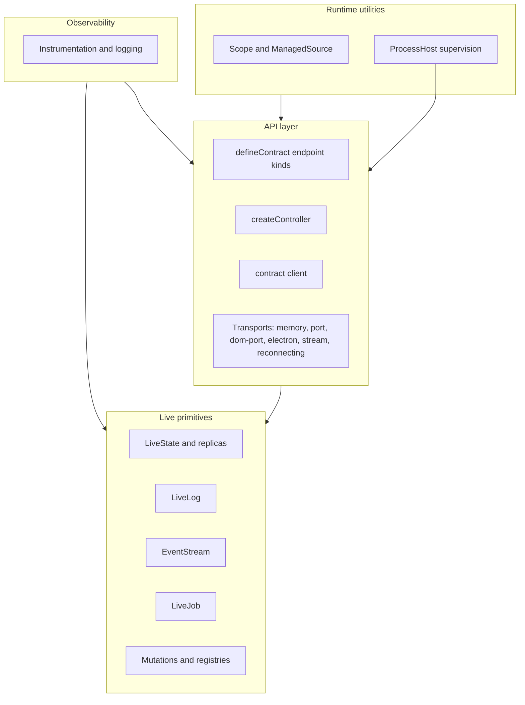

# @emdash/wire Docs

`@emdash/wire` is the transport-agnostic runtime layer for typed API calls,
live model subscriptions, live logs, event streams, jobs, mutations, and a small
set of utilities that sit at the API boundary.

The package has four layers:



The live layer owns the stateful primitives: `LiveState`, `LiveLog`,
`EventStreamSource`, `LiveJob`, `LiveModelHost`, and consumer-instantiated
replicas. Low-level `*Client` followers track cursors and resync, while
materializers (`StateStore`, `LogSink`, `JobStore`) own values. Most consumers use
client handles directly or wrap them in replicas. The API layer turns those
primitives into a contract with typed procedure calls and live topic client
handles.
The runtime layer owns lifecycle utilities and process supervision. Observability
hooks are cross-cutting and can be attached to API, live, and runtime surfaces.

## Pages

- API:
  - [Contracts](./api/contracts.md): `defineContract()`, endpoint kinds, nested
    composition, and live model groups.
  - [Serving and clients](./api/serving.md): `createController()`, `serve()`,
    `connect()`, cancellation, controller composition, session hubs, and
    server-side call helpers.
  - [Typed clients](./api/clients.md): `ContractClient` handles,
    `forwardController()`, and selective forwarding through `createController()`.
  - [File endpoints](./api/files.md): `downloadFile()`, `uploadFile()`, blob
    channels, and binary stream transport framing.
  - [Wire errors](./api/errors.md): error planes, `WireErrorCode` meanings,
    origins, and retry guidance.
  - [Transports](./api/transports.md): memory, ports, Electron, streams,
    reconnecting, process, and logging transports.
- Live:
  - [Live models and protocol](./live/live-state.md): snapshots, updates,
    cursors, `LiveState`, replicas, and `BatchedLiveState`.
  - [Live logs](./live/live-log.md): retained terminal-style logs and client
    callbacks.
  - [Event streams](./live/event-stream.md): keyed fire-and-forget events with
    explicit gap callbacks after reattach.
  - [Live jobs](./live/live-job.md): progress, cancellation, terminal state,
    retention, and contract job handles.
  - [Mutations](./live/mutations.md): mutation ids, host contexts, cursor settling,
    idempotency cache, and retry behavior.
  - [Replicas](./live/replicas.md): `LiveModelReplica`, `LiveLogReplica`,
    `LiveJobReplica`, pluggable stores, ref counting, and serving cached state.
  - [Optimistic live model groups](./live/optimistic-group.md): MobX-backed
    optimistic previews for live model contract mutations.
- Runtime:
  - [Lifecycle utilities](./runtime/lifecycle.md): `Scope`, scope loggers,
    `describeScope()`, and `ManagedSource`.
  - [ProcessHost](./runtime/process-host.md): supervised child/utility processes
    and process-backed wire transports.
  - [Process runtimes](./runtime/process-runtimes.md): subprocess-hosted
    controllers with ready handshakes, graceful shutdown, and reconnect resync.
  - [Workers](./runtime/workers.md): worker lifecycle helpers, lazy spawning,
    ambient logging, and process-hosted contract examples.
- [Observability](./observability.md): ambient logger context, instrumentation
  hooks, controller logging, transport debug logging, and scope loggers.

Runnable examples live under [../examples](../examples). Most snippets in these
docs are shortened versions of those files.

## Package Exports

Use the broad `@emdash/wire` export when building examples or package-local
features that need both API and live primitives:

```ts
import { createController, LiveState, defineContract } from '@emdash/wire';
```

Use narrower subpath exports at app boundaries:

- `@emdash/wire/live`: live primitives, live model hosts, and mutation settling.
- `@emdash/wire/api`: contract definition, controller creation, client creation, and transports.
- `@emdash/wire/observability`: instrumentation hooks, logger adapters, and
  controller logging middleware.
- `@emdash/wire/util`: dependency-free utilities: `Scope`, `ManagedSource`,
  and `deduplicateRequests`.
- `@emdash/wire/util/mobx`: MobX-backed replica stores
  (`createImmutableMobxStore`, `createReactiveMobxStore`, `createMobxLogStore`)
  and optimistic group utilities.
- `@emdash/wire/util/process-runtime`: helpers for serving and consuming
  process-hosted wire controllers.
- `@emdash/wire/worker`: worker helpers for resolving runtime entries,
  supervised spawning, and lazy process lifecycle.
- `@emdash/wire/process`: process supervision types, `utilityProcessHost()`,
  and `processTransport()`.
- `@emdash/wire/process/node`: Node `childProcessHost()`.

MobX-backed utilities intentionally live in their own export because they have a
`mobx` peer dependency. Server-only code can import `@emdash/wire` or
`@emdash/wire/util` without pulling in MobX.

## Typical Flow

1. Define a contract with `defineContract({ ... })`.
2. Create server-side `LiveState`, `LiveLog`, `EventStreamSource`, `LiveJob`, or
   `createLiveModelHost()` instances.
3. Create and dispose keyed host instances as domain resources appear.
4. Create a controller with `createController(contract, impl)`.
5. Optionally wrap the controller with `withValidation(contract, controller, policy)`.
6. Serve the controller over a `WireTransport`.
7. Connect from the client and create a typed `client()`.
8. Use client handles directly for streaming, or create replicas when local state,
   ref counting, or downstream serving is needed.

For a complete example in one file, see [../examples/contract/client.ts](../examples/contract/client.ts).
