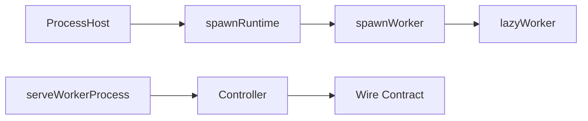

# Workers

A worker is a supervised child process that serves a wire contract over the
process IPC channel. The parent owns process lifecycle and reconnect behavior,
while the child keeps normal wire setup visible: build a controller, optionally
wrap it with `withValidation()`, and serve it with `serveWorkerProcess()`.

Use workers when the child can rebuild authoritative state after restart and
clients can recover through live snapshots, event-stream gaps, or domain replay.

## Layers



- `ProcessHost` adapts Node `child_process.fork()`, Electron utility processes,
  or tests to a supervised `ManagedProcess`.
- `spawnRuntime()` adds the wire ready handshake, graceful shutdown signal, and
  reconnect-aware typed client.
- `spawnWorker()` adds worker defaults: supervision, scope ownership, lifecycle
  logs, and runtime log forwarding.
- `lazyWorker()` adds a retryable singleton around `spawnWorker()`.
- `serveWorkerProcess()` is the child-side IPC bridge. Controller composition
  stays explicit at the boot file.

## Parent Side

Worker entry paths are owned by the host build. Apps should register worker
entries in a host-local manifest, feed that manifest into their build config, and
pass the emitted path to `spawnWorker()`:

```ts
import { spawnWorker } from '@emdash/wire/worker';
import { createScope } from '@emdash/wire/util';
import { api } from './contract';
import { workerPath } from './worker-manifest';

const scope = createScope({ label: 'main' });
const worker = await spawnWorker({
  name: 'counter',
  contract: api,
  entry: workerPath('counter'),
  scope,
  env: process.env,
});

await worker.client.increment(undefined);
await scope.dispose();
```

`spawnWorker()` creates a `worker:<name>` child scope. Disposing the returned
handle disposes that scope; disposing any ancestor scope also tears down the
worker. Logs use `scope.log`, so a caller that initialized the ambient logger
gets the same logger and scope fields automatically.

The default supervision policy is:

```ts
{ restart: 'on-failure', backoffMs: [250, 1_000, 2_500], maxRestarts: 5 }
```

Pass `host` to use something other than the default Node `childProcessHost()`.
Pass `supervision` to override restart behavior.

## Lifecycle Hooks

`WorkerHandle.onRestarted(cb)` fires every time a supervised restart completes
and the child sends its ready signal. Use it for recurring domain repair, such as
replaying leases after a file-watch worker restarts.

`WorkerHandle.whenExited` resolves only for terminal exits where supervision will
not restart the child. It is useful for monitoring, health checks, and tests.

## Lazy Workers

Use `lazyWorker()` when the process should start on first use:

```ts
const worker = lazyWorker(
  () => ({
    name: 'indexer',
    contract: indexerContract,
    entry: workerPath('indexer'),
    scope,
  }),
  {
    onSpawned: (handle) => {
      handle.onRestarted(() => markIndexStale());
    },
  }
);

const handle = await worker.get();
await handle.client.rebuild({ root });
await worker.dispose();
```

Concurrent `get()` calls share one pending spawn. If spawning fails, the pending
promise is cleared so the next `get()` retries. `onSpawned` runs once per
successful spawn, not on every supervised child restart.

## Child Side

The child entry stays declarative:

```ts
import { initProcessLogging } from '@emdash/shared/logger/node';
import { createController, withValidation } from '@emdash/wire';
import { serveWorkerProcess, workerValidatePolicy } from '@emdash/wire/util/process-runtime';
import { api } from './contract';

const env = process.env;
const logger = initProcessLogging({ name: 'counter-runtime', env });

void serveWorkerProcess(
  (scope) => {
    const controller = createController(api, {
      increment: () => 1,
    });
    scope.add(() => console.log('counter worker disposed'));
    return withValidation(api, controller, workerValidatePolicy(env));
  },
  { logger }
);
```

`serveWorkerProcess()` detects the parent IPC channel, serves wire messages,
sends the ready signal after the controller is served, disposes the root scope on
shutdown or parent disconnect, and exits. If initialization fails, it logs the
failure and calls `exit(1)`.

Tests can pass `port`, `exit`, and `logger` seams to run the child helper without
forking a real process.
